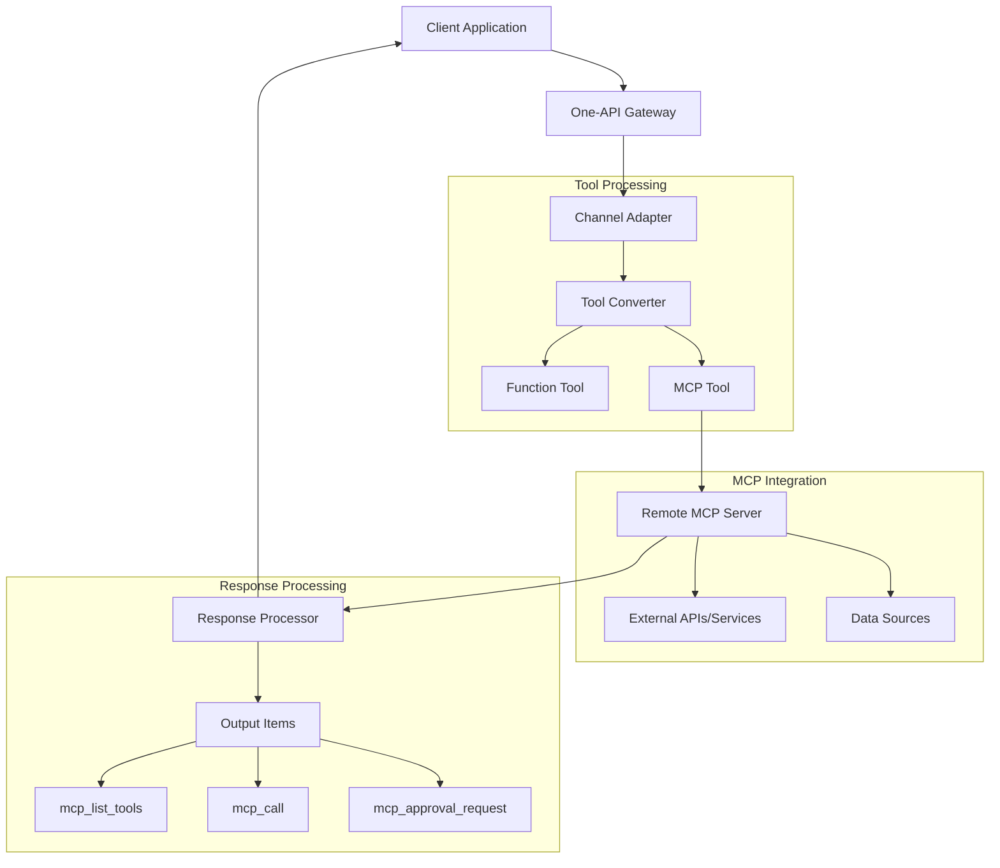
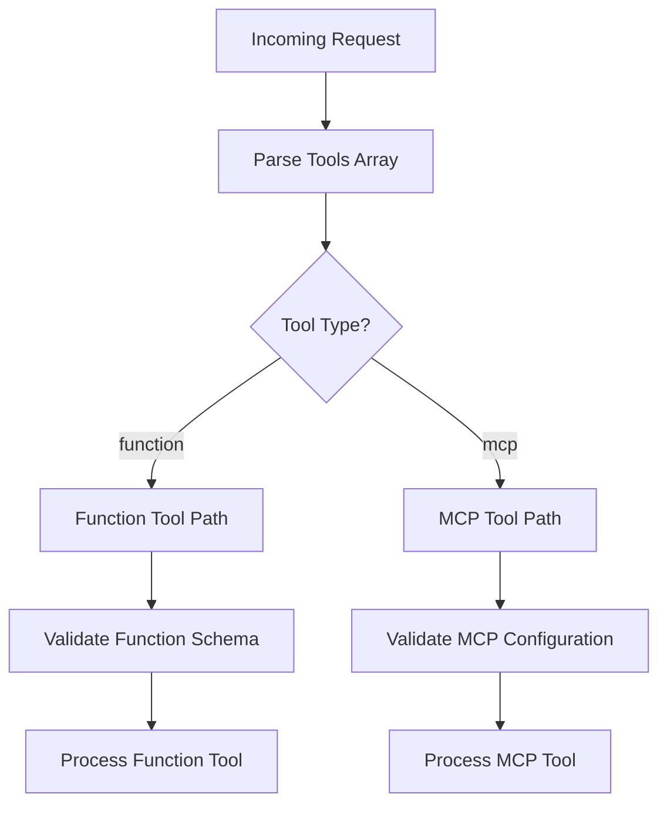
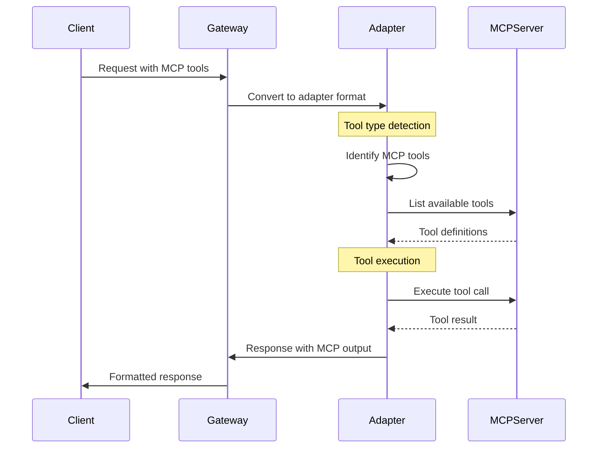
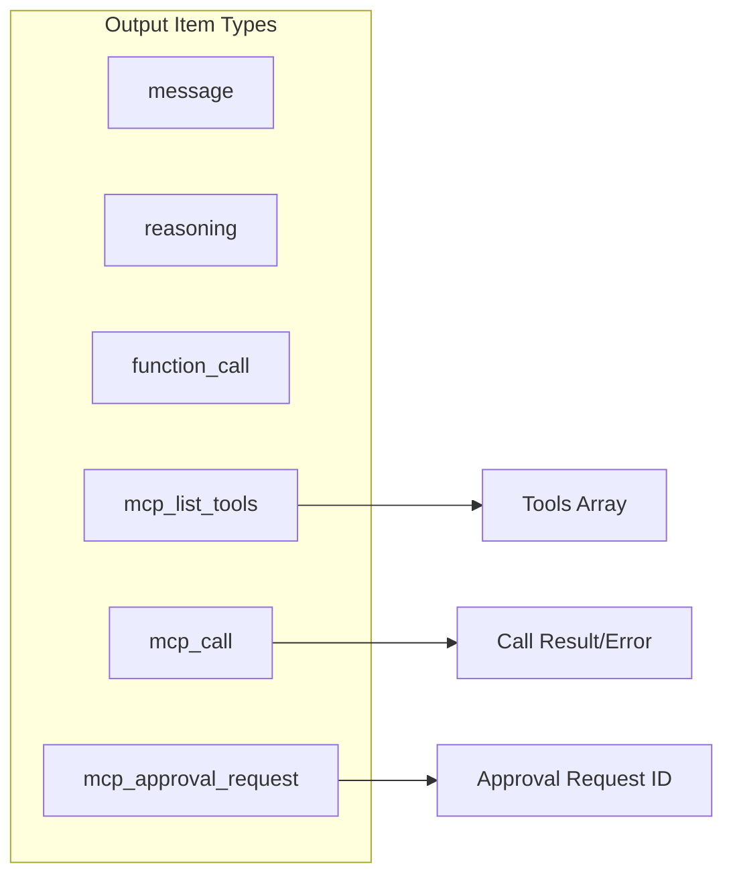
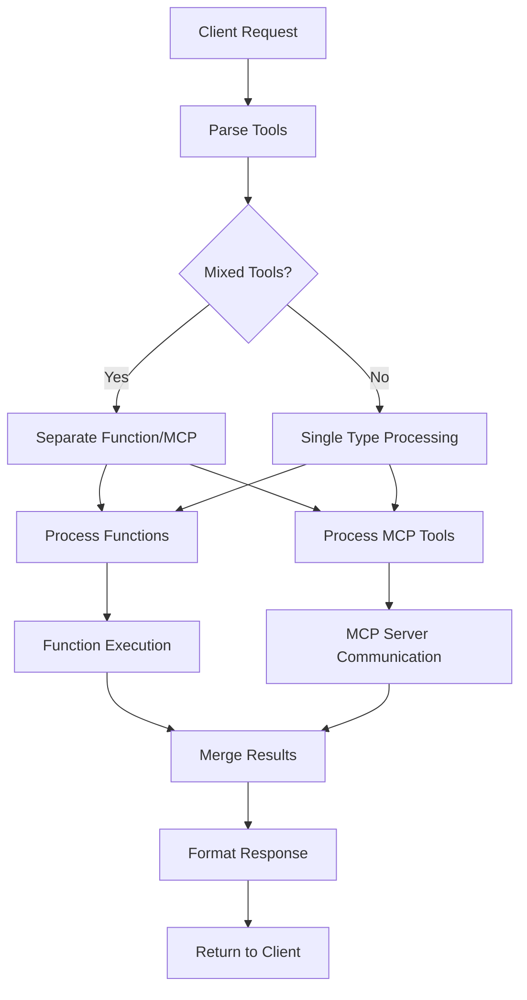
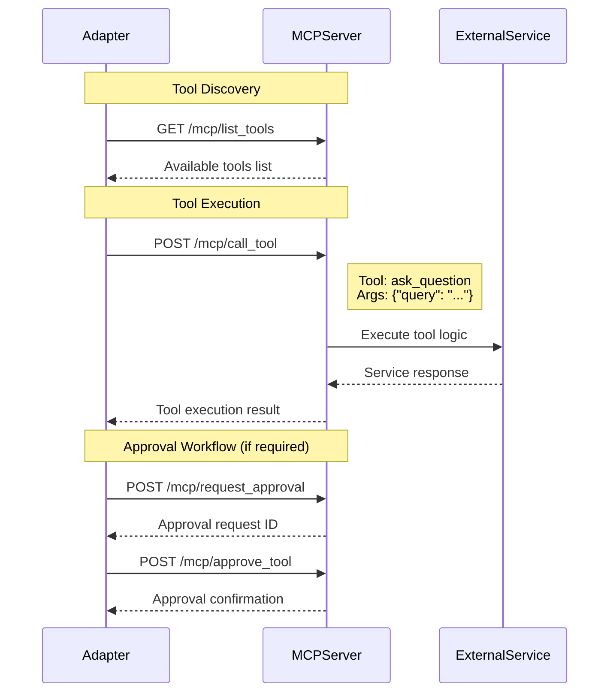
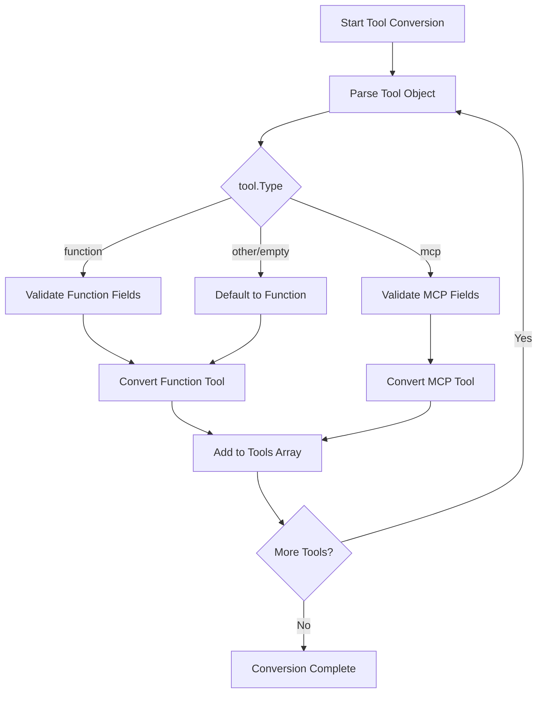
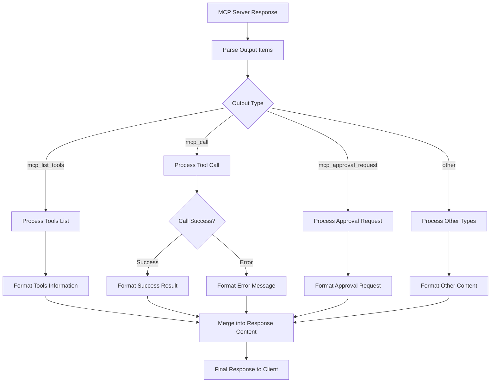

# Model Context Protocol (MCP) Architecture

## Overview

The Model Context Protocol (MCP) implementation in one-api provides support for remote MCP servers, enabling AI models to access external tools and data sources through a standardized protocol. This document describes the architecture, data flow, and implementation details of MCP support.

## What is MCP?

Model Context Protocol (MCP) is an open standard for connecting AI applications with external tools and data sources. It provides a common protocol for models to access:

- **Functions (Tools)**: External capabilities that models can invoke
- **Resources**: Data sources that models can query
- **Prompts**: Predefined prompt templates

## Architecture Overview

The MCP implementation extends the existing tool system to support both traditional function tools and remote MCP servers:



## Data Model

### Tool Structure

The `Tool` struct supports both function and MCP tools:

```go
type Tool struct {
    Id       string    `json:"id,omitempty"`
    Type     string    `json:"type,omitempty"`     // "function" or "mcp"
    Function *Function `json:"function,omitempty"` // For function tools
    Index    *int      `json:"index,omitempty"`

    // MCP-specific fields
    ServerLabel     string            `json:"server_label,omitempty"`
    ServerUrl       string            `json:"server_url,omitempty"`
    RequireApproval any               `json:"require_approval,omitempty"`
    AllowedTools    []string          `json:"allowed_tools,omitempty"`
    Headers         map[string]string `json:"headers,omitempty"`
}
```

### MCP Tool Configuration

MCP tools are configured with server connection details:

- **ServerLabel**: Human-readable identifier for the MCP server
- **ServerUrl**: Endpoint URL for the remote MCP server
- **RequireApproval**: Approval policy ("never" or object with tool-specific settings)
- **AllowedTools**: Whitelist of allowed tool names from the server
- **Headers**: Authentication and custom headers for server requests

## System Design

### 1. Tool Type Detection



### 2. MCP Tool Processing



### 3. Response API Integration

The OpenAI Response API format supports MCP through extended output items:



## Data Flow

### 1. Request Processing Flow



### 2. MCP Server Communication Flow



## Control Flow

### 1. Tool Conversion Logic



### 2. Response Processing Logic



## Implementation Details

### Key Components

1. **Tool Type System**: Discriminated union supporting both function and MCP tools
2. **Response API Extensions**: Enhanced output items for MCP-specific responses
3. **Parameter Validation**: Type-safe parameter handling with proper error checking
4. **Approval Workflow**: Support for MCP tool approval mechanisms

### Function Pointer Migration

The patch changes the `Function` field from value type to pointer type across all adapters:

```go
// Before
Function: model.Function{
    Name: "tool_name",
    Description: "description",
}

// After
Function: &model.Function{
    Name: "tool_name",
    Description: "description",
}
```

This change provides:

- **Null Safety**: Ability to represent absent functions for MCP tools
- **Memory Efficiency**: Reduced copying of function structs
- **Type Consistency**: Uniform pointer semantics across the codebase

### Enhanced Parameter Handling

The Anthropic adapter now includes improved parameter validation:

```go
// Safe parameter extraction with type checking
params, ok := tool.Function.Parameters.(map[string]interface{})
if !ok {
    return nil, errors.New("tool function parameters is not a map")
}

var schema InputSchema
// Guarded extraction for 'type'
if t, ok := params["type"].(string); ok {
    schema.Type = t
}
```

### Backward Compatibility

The implementation maintains full backward compatibility:

- Existing function tools continue to work unchanged
- New MCP tools are additive and don't affect existing functionality
- Response format extensions are optional and gracefully handled

### Security Considerations

- **Server Validation**: MCP server URLs and configurations are validated
- **Tool Whitelisting**: `AllowedTools` field restricts available tools
- **Approval Workflow**: `RequireApproval` enables human oversight
- **Header Security**: Authentication headers are properly handled

## Testing Strategy

The implementation includes comprehensive tests:

1. **Unit Tests**: Individual component testing
2. **Integration Tests**: End-to-end MCP workflow testing
3. **Serialization Tests**: JSON round-trip validation
4. **Mixed Tool Tests**: Function and MCP tools together
5. **Error Handling Tests**: Failure scenario coverage

### Test Coverage Areas

- MCP tool serialization and deserialization
- Response API conversion with MCP tools
- Mixed function and MCP tool scenarios
- Parameter validation and error handling
- JSON round-trip compatibility

## Future Enhancements

Potential areas for future development:

1. **Caching**: MCP server response caching for performance
2. **Load Balancing**: Multiple MCP server instances
3. **Monitoring**: MCP server health and performance metrics
4. **Advanced Approval**: More sophisticated approval workflows
5. **Tool Discovery**: Dynamic tool discovery and registration

## Migration Guide

### For Existing Implementations

The Function pointer migration requires updating any code that directly creates `model.Tool` instances:

```go
// Update tool creation
tool := model.Tool{
    Type: "function",
    Function: &model.Function{  // Add & here
        Name: "my_function",
        Description: "My function description",
        Parameters: params,
    },
}
```

### For New MCP Tools

Register MCP tools through the admin MCP server registry. Client requests should **not** declare `type: "mcp"`; they must use standard built-in tool types.

## How-to-Use

This section provides concrete examples for invoking Remote MCP tools through one-api across all supported API formats (OpenAI ChatCompletion, OpenAI Response API, Claude Messages).

### 1. OpenAI ChatCompletion API

Send standard built-in tools in the `tools` array. one-api matches tool `type` to MCP tools when names align. Example:

```bash
curl $ONE_API_BASE/v1/chat/completions \
    -H "Authorization: Bearer $TOKEN" \
    -H "Content-Type: application/json" \
    -d '{
        "model": "gpt-4o",
        "messages": [
            {"role": "user", "content": "What transport protocols are in the 2025-03-26 MCP spec?"}
        ],
        "tools": [
            { "type": "web_search" }
        ]
    }'
```

The model will emit standard tool calls. one-api executes MCP tools transparently and returns results using standard tool result messages.

### 2. OpenAI Response API

When the model supports the Response API, one-api converts ChatCompletion requests. You can also call the Response API directly with standard tool types.

```bash
curl $ONE_API_BASE/v1/responses \
    -H "Authorization: Bearer $TOKEN" \
    -H "Content-Type: application/json" \
    -d '{
        "model": "gpt-4o",
                "input": [ {"role": "user", "content": "Find a positive news story"} ],
                "tools": [ { "type": "web_search" } ]
    }'
```

Tool calls appear as standard function tool calls in OpenAI Responses output items.

### 3. Claude Messages API

Use the standard Claude tool types. If an MCP tool named `web_search_20250305` is configured, one-api will route the Claude tool call through MCP execution.

### 4. Mixed Tools

You can mix standard function tools with MCP-backed built-in tools. Example (ChatCompletion-style):

```json
{
  "tools": [
    {
      "type": "function",
      "function": {
        "name": "get_weather",
        "description": "Get weather",
        "parameters": {
          "type": "object",
          "properties": { "location": { "type": "string" } }
        }
      }
    },
    { "type": "web_search" }
  ]
}
```

### 5. Validation Helpers

All tools pass through `model.Tool.Validate()`. For custom ingestion code you may call:

```go
if err := tool.Validate(); err != nil { /* reject */ }
```

### 6. Error Handling

MCP transport / server errors appear as standard tool result errors. In ChatCompletion fallback these are appended to assistant text as: `MCP Tool '<name>' error: <message>`.

### 7. Security Recommendations

1. Always use HTTPS MCP endpoints.
2. Use `allowed_tools` to restrict surface area.
3. Set `require_approval` for sensitive tool names (leave others as `never`).
4. Never log sensitive headers (they are not currently redacted automatically).

### 8. Troubleshooting

| Symptom                | Cause                                                       | Fix                                                    |
| ---------------------- | ----------------------------------------------------------- | ------------------------------------------------------ |
| Tool not routed to MCP | No MCP tool matches tool type                               | Confirm MCP tool name matches built-in tool type       |
| Panic on nil function  | Old code constructing `Tool{Function: model.Function{...}}` | Update to pointer: `Function: &model.Function{...}`    |
| No MCP output visible  | MCP tool not configured or disallowed by policy             | Check MCP server whitelist/blacklist and channel rules |

### 9. Migration Checklist

1. Replace value usage: `Function: model.Function{...}` -> `Function: &model.Function{...}`.
2. When unmarshalling JSON verify `tool.Function` nil before dereference.
3. Add validation step for externally supplied MCP tool objects.
4. Update any custom serialization assumptions (Function no longer guaranteed non-nil).
