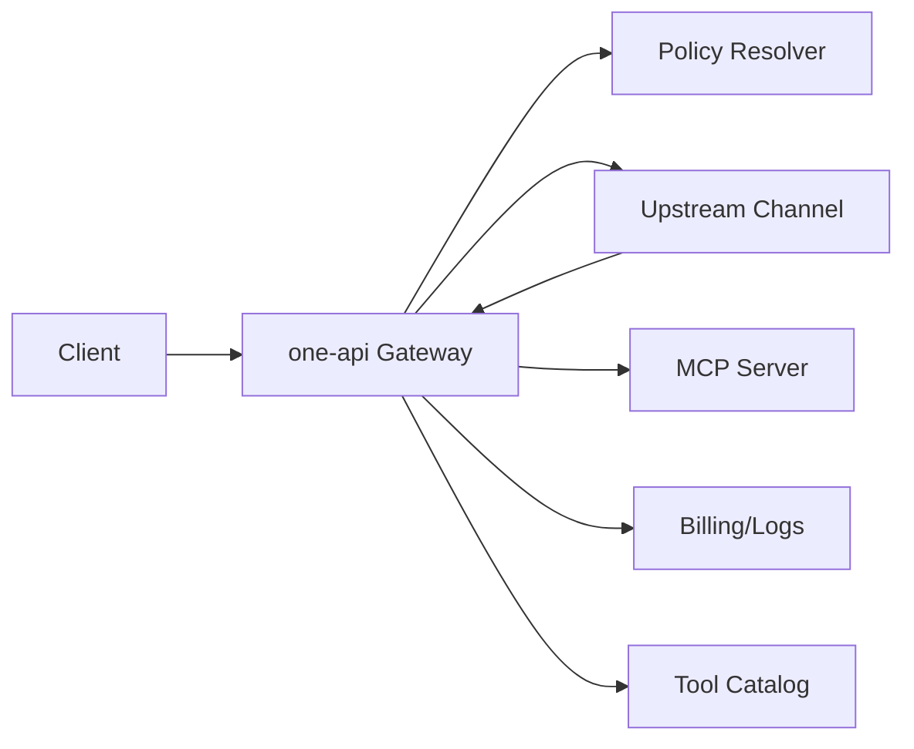

# MCP Aggregator Technical Implementation Manual

This document provides a detailed architecture and implementation plan for the MCP Aggregator feature in one‑api. It is intended for direct use by the development team and aligns with 2025‑2026 best practices for reliability, security, and observability.

- [Requirement: MCP Aggregator Management Layer](../requirements/mcp_aggregator.md)

## Menu

- [MCP Aggregator Technical Implementation Manual](#mcp-aggregator-technical-implementation-manual)
  - [Menu](#menu)
  - [1) Objectives and Scope](#1-objectives-and-scope)
    - [Objectives](#objectives)
    - [Out of Scope](#out-of-scope)
  - [2) Overall Architecture](#2-overall-architecture)
    - [High‑level components](#highlevel-components)
    - [Data flow overview](#data-flow-overview)
  - [3) Tool Ownership and Multi‑Round Orchestration](#3-tool-ownership-and-multiround-orchestration)
    - [Tool categories](#tool-categories)
    - [Orchestration contract](#orchestration-contract)
    - [Execution loop](#execution-loop)
    - [Idempotency rules](#idempotency-rules)
  - [4) Data Model Design](#4-data-model-design)
    - [Tables](#tables)
    - [Policy semantics](#policy-semantics)
  - [5) API Design](#5-api-design)
    - [Admin APIs](#admin-apis)
    - [Tool Catalog](#tool-catalog)
    - [MCP Proxy](#mcp-proxy)
  - [6) Code Design and Module Layout](#6-code-design-and-module-layout)
    - [Proposed packages](#proposed-packages)
    - [Integration touchpoints](#integration-touchpoints)
    - [Error handling](#error-handling)
  - [7) SDK and Dependency Usage](#7-sdk-and-dependency-usage)
    - [MCP client SDK](#mcp-client-sdk)
      - [Install](#install)
      - [Usage pattern](#usage-pattern)
    - [Configuration](#configuration)
  - [8) UI Implementation Guide (Modern Template)](#8-ui-implementation-guide-modern-template)
    - [MCPs List](#mcps-list)
    - [MCP Server Edit](#mcp-server-edit)
    - [Channel/User Edit](#channeluser-edit)
    - [Shared UI component](#shared-ui-component)
  - [9) Security and Compliance](#9-security-and-compliance)
  - [10) Observability](#10-observability)
  - [11) Work Schedule Planning](#11-work-schedule-planning)
    - [Phase 1: Foundations (Week 1)](#phase-1-foundations-week-1)
    - [Phase 2: Core orchestration (Week 2)](#phase-2-core-orchestration-week-2)
    - [Phase 3: Policy + Pricing (Week 3)](#phase-3-policy--pricing-week-3)
    - [Phase 4: UI and Admin UX (Week 4)](#phase-4-ui-and-admin-ux-week-4)
    - [Phase 5: Proxy Endpoint and Hardening (Week 5)](#phase-5-proxy-endpoint-and-hardening-week-5)
  - [12) Test Strategy](#12-test-strategy)
  - [13) Delivery Checklist](#13-delivery-checklist)

## 1) Objectives and Scope

### Objectives

- Aggregate multiple MCP servers and expose their tools as built‑in tools to downstream users.
- Support layered policy controls (server whitelist/blacklist, channel/user blacklists).
- Orchestrate multi‑round tool calls with strict tool ownership separation.
- Provide accurate billing and logging for MCP tool usage.
- Provide admin UI and APIs for management and visibility.
- Provide a public `/mcp` proxy endpoint for MCP clients.

### Out of Scope

- Building third‑party MCP server UIs.
- Automatic upstream account provisioning or direct billing integration with MCP providers.
- Replacing upstream provider built‑in tools.

## 2) Overall Architecture

### High‑level components

1. **MCP Server Registry**
   - Stores MCP server metadata, auth config, policy lists, and pricing overrides.
2. **Tool Catalog**
   - Stores tool metadata synchronized from MCP servers.
3. **Policy Resolver**
   - Resolves per‑request tool eligibility using server whitelist/blacklist, channel/user blacklists, and request `allowed_tools`.
4. **Tool Orchestrator**
   - Converts one‑api built‑ins to local tools, executes MCP calls, and manages multi‑round tool execution.
5. **Billing/Logging Adapter**
   - Accounts for per‑tool costs and records usage metadata.
6. **MCP Proxy Server**
   - Exposes `/mcp` endpoints backed by configured MCP tools.

### Data flow overview



## 3) Tool Ownership and Multi‑Round Orchestration

### Tool categories

- `user_local`: tools defined by the client.
- `channel_builtin`: tools built into upstream providers.
- `oneapi_builtin`: MCP aggregated tools.

### Orchestration contract

- Convert `oneapi_builtin` to local tools before upstream dispatch.
- Keep `channel_builtin` as built‑ins for upstream.
- Preserve `user_local` as local tools and never execute them in one‑api.
- When multiple MCP servers publish the same tool name, match by name + canonical parameter signature; if multiple matches remain, prefer the highest‑priority server and retry lower‑priority servers on failure.

### Execution loop

1. Parse tools from request.
2. Classify tools by source.
3. Convert one‑api built‑ins → local tool definitions with stable names.
4. Dispatch to upstream.
5. On tool calls:
   - If `user_local`: return tool call for user flow.
   - If `oneapi_builtin`: invoke MCP, append tool result, continue upstream.
6. Repeat for multi‑round tool calls until completion or max rounds.
7. Track tool usage for billing/logs.

### Idempotency rules

- Maintain `tool_call_id` mapping to avoid double‑charging or double‑execution on retries.

## 4) Data Model Design

### Tables

1. `mcp_servers`

- `id`, `name`, `description`, `status`, `priority`, `base_url`, `protocol`, `auth_type`, `api_key`, `headers`
- `tool_whitelist`, `tool_blacklist`, `tool_pricing`
- `auto_sync_enabled`, `auto_sync_interval_minutes`
- `last_sync_at`, `last_sync_status`, `last_sync_error`
- `last_test_at`, `last_test_status`, `last_test_error`
- `created_at`, `updated_at`

2. `mcp_tools`

   - `id`, `server_id`, `name`, `display_name`, `description`, `input_schema`
   - `default_pricing`, `status`, `created_at`, `updated_at`

3. `channels` extension

   - `mcp_tool_blacklist` in channel config JSON

4. `users` extension
   - `mcp_tool_blacklist` in user config JSON

### Policy semantics

- Tool usable **only if** in server whitelist **and** not in server blacklist.
- If tool is in any blacklist (server/channel/user), it is denied.
- Server whitelist default empty → deny by default.

## 5) API Design

### Admin APIs

- `GET /api/mcp_servers`
- `GET /api/mcp_servers/:id`
- `POST /api/mcp_servers`
- `PUT /api/mcp_servers/:id`
- `DELETE /api/mcp_servers/:id`
- `POST /api/mcp_servers/:id/sync`
- `POST /api/mcp_servers/:id/test`
- `GET /api/mcp_servers/:id/tools`

### Tool Catalog

- `GET /api/mcp_tools?server_id=&status=`

### MCP Proxy

- `POST /mcp` (Streamable HTTP MCP protocol)

## 6) Code Design and Module Layout

### Proposed packages

- `model/mcp_server.go`, `model/mcp_tool.go`
- `controller/mcp_server.go`, `controller/mcp_tool.go`
- `relay/mcp/client.go` (Streamable HTTP MCP client wrapper)
- `relay/mcp/registry.go` (registry + policy resolution)
- `relay/mcp/orchestrator.go` (tool execution loop)
- `relay/mcp/sync.go` (auto background sync)
- `router/api.go` additions for MCP endpoints
- `web/modern/src/pages/mcp/*` UI pages and components

### Integration touchpoints

- Tool conversion: `relay/model/tool.go` and request conversion layers.
- Tool billing: extend `ToolUsageSummary` aggregation in `relay/tooling/tools.go`.
- Logs: attach `tool_usage.entries` metadata (server id, tool name, count, cost).

### Error handling

- Wrap all errors with `github.com/Laisky/errors/v2`.
- Each error is either logged or returned, not both.

## 7) SDK and Dependency Usage

### MCP client SDK

Recommended: `mark3labs/mcp-go` for Streamable HTTP MCP.

#### Install

```bash
go get github.com/mark3labs/mcp-go@latest
```

#### Usage pattern

- Initialize client with server base URL + headers.
- Call MCP `list_tools` to sync catalog.
- Call MCP `call_tool` for tool invocations.

### Configuration

- Add protocol adapters behind an interface to allow adding SSE/other protocols later.
- Use context deadlines for MCP calls (timeouts enforced in orchestrator).

## 8) UI Implementation Guide (Modern Template)

### MCPs List

- Columns: status, base URL, protocol, auth method, auth status, last sync, tool count, auto‑sync interval.
- Actions: add, edit, delete, sync, view tools.

### MCP Server Edit

- Sections: Basic Info, Auth, Protocol, Tool Policy, Pricing Overrides.
- Include priority input aligned with the channel priority UX.
- Auto‑sync settings (default 60 minutes).
- “Test Connection” button after auth inputs.
- Tool management panel with allow/deny toggles, pricing, and missing‑price warning.

### Channel/User Edit

- Add MCP tool blacklist selectors (multi‑select + manual entry).

### Shared UI component

- Reusable allowlist/blacklist manager (search, multi‑select, manual entry, missing‑price warning).

## 9) Security and Compliance

- Encrypt MCP server secrets at rest.
- Do not log secrets or headers.
- Enforce auth on all admin endpoints.
- Validate MCP server URLs (http/https only).

## 10) Observability

- Track sync failures with structured logs.
- Add tracing tags for MCP tool usage (server, tool, cost).
- Store per‑tool usage metadata in logs (`tool_usage.entries`).

## 11) Work Schedule Planning

### Phase 1: Foundations (Week 1)

- Define data models and migrations (`mcp_servers`, `mcp_tools`).
- Add API skeletons for MCP server CRUD and tool catalog.
- Define MCP client interface and Streamable HTTP adapter.

### Phase 2: Core orchestration (Week 2)

- Implement tool registry and classification.
- Implement conversion of one‑api built‑ins → local tools.
- Implement MCP tool invocation and multi‑round loop.

### Phase 3: Policy + Pricing (Week 3)

- Implement layered policy resolution (server/channel/user/allowed_tools).
- Implement per‑server pricing resolution and missing‑price warnings.

### Phase 4: UI and Admin UX (Week 4)

- MCPs List page and MCP Edit page.
- Add channel/user MCP tool blacklists.
- Add shared allowlist/blacklist UI component.

### Phase 5: Proxy Endpoint and Hardening (Week 5)

- Implement `/mcp` proxy server.
- Finalize logging/billing integration and telemetry.
- Complete load tests for auto‑sync and tool orchestration.

## 12) Test Strategy

- Unit tests for policy resolution, pricing resolution, and tool registry.
- Integration tests for MCP sync and MCP tool execution.
- Relay tests for multi‑round tool execution with mixed tool sources.
- UI tests for MCP list/edit and blacklist management.

## 13) Delivery Checklist

- Data migrations applied.
- Admin APIs documented and tested.
- UI pages wired with permissions.
- Billing/logging validated.
- `/mcp` endpoint validated.
