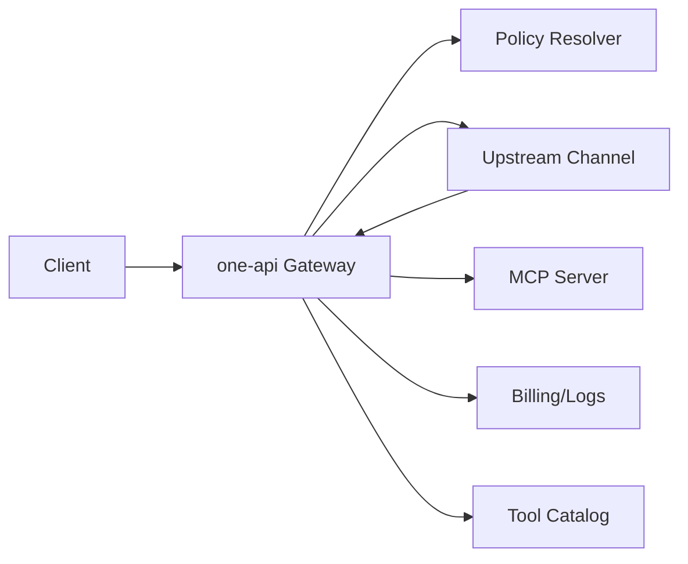

# MCP Aggregator Technical Implementation Manual

This document provides a detailed architecture and implementation plan for the MCP Aggregator feature in one‑api. It is intended for direct use by the development team and aligns with 2025‑2026 best practices for reliability, security, and observability.

- [Requirement: MCP Aggregator Management Layer](../requirements/mcp_aggregator.md)

## Menu

- [MCP Aggregator Technical Implementation Manual](#mcp-aggregator-technical-implementation-manual)
  - [Menu](#menu)
  - [1) Objectives and Scope](#1-objectives-and-scope)
    - [Objectives](#objectives)
    - [Out of Scope](#out-of-scope)
  - [2) Overall Architecture](#2-overall-architecture)
    - [MCP primer](#mcp-primer)
    - [High‑level components](#highlevel-components)
    - [Data flow overview](#data-flow-overview)
    - [Request and response flow](#request-and-response-flow)
  - [3) Tool Ownership and Multi‑Round Orchestration](#3-tool-ownership-and-multiround-orchestration)
    - [Tool categories](#tool-categories)
    - [Tool matching and aliasing](#tool-matching-and-aliasing)
    - [Orchestration contract](#orchestration-contract)
    - [Execution loop](#execution-loop)
    - [Idempotency rules](#idempotency-rules)
  - [4) Data Model Design](#4-data-model-design)
    - [Tables](#tables)
    - [Policy semantics](#policy-semantics)
  - [5) API Design](#5-api-design)
    - [Admin APIs](#admin-apis)
    - [Tool Catalog](#tool-catalog)
    - [MCP Proxy](#mcp-proxy)
    - [Client request examples](#client-request-examples)
  - [6) Code Design and Module Layout](#6-code-design-and-module-layout)
    - [Proposed packages](#proposed-packages)
    - [Integration touchpoints](#integration-touchpoints)
    - [Error handling](#error-handling)
  - [7) SDK and Dependency Usage](#7-sdk-and-dependency-usage)
    - [MCP client implementation](#mcp-client-implementation)
    - [Configuration](#configuration)
  - [8) UI Implementation Guide (Modern Template)](#8-ui-implementation-guide-modern-template)
    - [MCPs List](#mcps-list)
    - [MCP Server Edit](#mcp-server-edit)
    - [MCP Tools](#mcp-tools)
    - [Channel/User Edit](#channeluser-edit)
    - [Shared UI component](#shared-ui-component)
  - [9) Security and Compliance](#9-security-and-compliance)
  - [10) Observability](#10-observability)
  - [Billing and quota reconciliation](#billing-and-quota-reconciliation)
  - [11) Work Schedule Planning](#11-work-schedule-planning)
    - [Phase 1: Foundations (Week 1)](#phase-1-foundations-week-1)
    - [Phase 2: Core orchestration (Week 2)](#phase-2-core-orchestration-week-2)
    - [Phase 3: Policy + Pricing (Week 3)](#phase-3-policy--pricing-week-3)
    - [Phase 4: UI and Admin UX (Week 4)](#phase-4-ui-and-admin-ux-week-4)
    - [Phase 5: Proxy Endpoint and Hardening (Week 5)](#phase-5-proxy-endpoint-and-hardening-week-5)
  - [12) Test Strategy](#12-test-strategy)
  - [13) Delivery Checklist](#13-delivery-checklist)

## 1) Objectives and Scope

### Objectives

- Aggregate multiple MCP servers and expose their tools as built‑in tools to downstream users.
- Support layered policy controls (server whitelist/blacklist, channel/user blacklists).
- Orchestrate multi‑round tool calls with strict tool ownership separation.
- Provide accurate billing and logging for MCP tool usage.
- Provide admin UI and APIs for management and visibility.
- Provide a public `/mcp` proxy endpoint for MCP clients.

### Out of Scope

- Building third‑party MCP server UIs.
- Automatic upstream account provisioning or direct billing integration with MCP providers.
- Replacing upstream provider built‑in tools.

## 2) Overall Architecture

### MCP primer

Model Context Protocol (MCP) is an open standard for connecting AI applications with external tools and data sources. In one‑api it provides a uniform way for upstream models to invoke external tools without vendor‑specific integrations. one‑api treats MCP tools as **oneapi_builtin** tools that are mapped from standard built‑in tool types (for example `web_search`). Explicit tool objects with `type: "mcp"` are rejected; clients must continue to use standard built‑ins so requests remain portable across providers. For Claude Messages and the OpenAI Response API, the tool `type` field is treated as the canonical MCP tool name.

### High‑level components

1. **MCP Server Registry**
   - Stores MCP server metadata, auth config, policy lists, and pricing overrides.
2. **Tool Catalog**
   - Stores tool metadata synchronized from MCP servers.
3. **Policy Resolver**
   - Resolves per‑request tool eligibility using server whitelist/blacklist, channel/user blacklists, and request `allowed_tools`.
4. **Tool Orchestrator**
   - Converts one‑api built‑ins to local tools, executes MCP calls, and manages multi‑round tool execution.
5. **Billing/Logging Adapter**
   - Accounts for per‑tool costs and records usage metadata.
6. **MCP Proxy Server**
   - Exposes `/mcp` endpoints backed by configured MCP tools.

### Data flow overview



### Request and response flow

1. **Request ingestion**

- MCP built‑ins are detected by matching tool `type` names against the synced MCP catalog.
- Optional server scoping is supported via `server.tool` aliases (for example `local-mcp.web_search`).

2. **Tool conversion**

- Matched MCP tools are converted into local `function` tools for upstream providers using the **synced MCP JSON schema** (`input_schema` or `inputSchema`) stored in the tool catalog. When a tool name exists in the MCP catalog, the upstream built‑in is not used.
- Tool choice is normalized to `function` when it targets an MCP tool name.

3. **Execution loop**

- Upstream tool calls are parsed; MCP tool calls are executed by one‑api and appended as `tool` messages.
- If any tool call is **not** MCP‑owned, one‑api returns the response without executing MCP tools.
- The loop continues until no tool calls remain or `MCPMaxToolRounds` is reached.
- If a lower‑priority MCP tool with the same name is retried after a failure, one‑api validates the tool call arguments against the fallback schema. When the arguments are incompatible, one‑api rebuilds the tool definition from the fallback schema and **reissues the previous upstream round**.

4. **Response API fallback**

- `/v1/responses` requests that reference MCP tools are routed through the ChatCompletion fallback so the MCP execution loop can run, then rewritten back to the Response API format.

## 3) Tool Ownership and Multi‑Round Orchestration

### Tool categories

- `user_local`: tools defined by the client.
- `channel_builtin`: tools built into upstream providers.
- `oneapi_builtin`: MCP aggregated tools.

### Tool matching and aliasing

- **Primary match**: tool `type` equals the MCP tool name (case‑insensitive).
- **Server‑qualified match**: `serverLabel.toolName` restricts matching to a single MCP server.
- **Built‑in aliases**: tool types normalized via `tooling.NormalizeBuiltinType` are treated as MCP candidates when a matching tool exists in the catalog.
- Explicit tool objects with `type: "mcp"` are rejected; only standard built‑in tool types are accepted.

### Orchestration contract

- Convert `oneapi_builtin` to local tools before upstream dispatch.
- Keep `channel_builtin` as built‑ins for upstream.
- Preserve `user_local` as local tools and never execute them in one‑api.
- When multiple MCP servers publish the same tool name, select the highest‑priority server first; tools with identical priority are chosen at random. Retry lower‑priority servers on failure. If fallback schemas are incompatible with the upstream tool call arguments, reissue the upstream round using the fallback schema.

### Execution loop

1. Parse tools from request and resolve MCP candidates.
2. Convert MCP candidates into local `function` tools.
3. Dispatch a single upstream request.
4. Parse tool calls from the first assistant choice.
5. If **any** tool call is not MCP‑owned, return the response without executing MCP tools.
6. Execute MCP tool calls sequentially:

- Deduplicate by `tool_call_id` to avoid double execution.
- Append MCP tool results as `tool` role messages (raw JSON preserved).
- Validate tool arguments against fallback schemas before retrying on lower‑priority tools.

7. Repeat until no tool calls remain or `MCPMaxToolRounds` is exceeded (default 10).
8. Record tool usage summary for billing/log metadata.

### Idempotency rules

- Maintain `tool_call_id` mapping to avoid double‑charging or double‑execution on retries.

## 4) Data Model Design

### Tables

1. `mcp_servers`

- `id`, `name`, `description`, `status`, `priority`, `base_url`, `protocol`, `auth_type`, `api_key`, `headers`
- `tool_whitelist`, `tool_blacklist`, `tool_pricing`
- `auto_sync_enabled`, `auto_sync_interval_minutes`
- `last_sync_at`, `last_sync_status`, `last_sync_error`
- `last_test_at`, `last_test_status`, `last_test_error`
- `created_at`, `updated_at`

2. `mcp_tools`
   - `id`, `server_id`, `name`, `display_name`, `description`, `input_schema`

- `default_pricing` (per‑tool USD/quota hints from MCP server), `status`, `created_at`, `updated_at`
  - `input_schema` stores the full JSON schema synchronized from MCP (`input_schema`/`inputSchema`) and is used to generate upstream function tools.

3. `channels` extension

- `mcp_tool_blacklist` in channel config JSON (denies matching MCP tool types)

4. `users` extension

- `mcp_tool_blacklist` in user config JSON

### Policy semantics

- Tool usable **only if** in server whitelist **and** not in server blacklist.
- If tool is in any blacklist (server/channel/user), it is denied.
- Server whitelist default empty → deny by default.

## 5) API Design

### Admin APIs

- `GET /api/mcp_servers`
- `GET /api/mcp_servers/:id`
- `POST /api/mcp_servers`
- `PUT /api/mcp_servers/:id`
- `DELETE /api/mcp_servers/:id`
- `POST /api/mcp_servers/:id/sync`
- `POST /api/mcp_servers/:id/test`
- `GET /api/mcp_servers/:id/tools`

### Tool Catalog

- `GET /api/mcp_tools?server_id=&status=`

### MCP Proxy

- `POST /mcp` (Streamable HTTP MCP protocol)

### Client request examples

**OpenAI ChatCompletion**

```bash
curl $ONE_API_BASE/v1/chat/completions \
  -H "Authorization: Bearer $TOKEN" \
  -H "Content-Type: application/json" \
  -d '{
    "model": "gpt-4o",
    "messages": [
      {"role": "user", "content": "Find a positive news story"}
    ],
    "tools": [
      {"type": "web_search"}
    ]
  }'
```

**OpenAI Response API**

```bash
curl $ONE_API_BASE/v1/responses \
  -H "Authorization: Bearer $TOKEN" \
  -H "Content-Type: application/json" \
  -d '{
    "model": "gpt-4o",
    "input": [
      {"role": "user", "content": "Find a positive news story"}
    ],
    "tools": [
      {"type": "web_search"}
    ]
  }'
```

**Claude Messages**

Use standard Claude tool types that map to MCP tool names (for example `web_search`). one‑api converts Claude Messages to ChatCompletions, executes MCP tools, and maps the response back.

## 6) Code Design and Module Layout

### Proposed packages

- `model/mcp_server.go`, `model/mcp_tool.go`
- `controller/mcp_server.go`, `controller/mcp_tool.go`, `controller/mcp_proxy.go`
- `relay/mcp/client.go` (Streamable HTTP MCP client)
- `relay/mcp/sync.go` (auto background sync)
- `relay/controller/mcp_orchestrator.go` (tool conversion + execution loop)
- `router/api.go` additions for MCP endpoints
- `web/modern/src/pages/mcp/*` MCP server UI
- `web/modern/src/pages/tools/ToolsPage.tsx` MCP tools browser

### Integration touchpoints

- Tool conversion: `relay/controller/mcp_orchestrator.go` and request conversion layers.
- Tool billing: `relay/tooling` + MCP tool usage summaries injected into consume logs.
- Logs: attach `tool_usage.entries` metadata (server id, tool name, count, cost).

### Error handling

- Wrap all errors with `github.com/Laisky/errors/v2`.
- Each error is either logged or returned, not both.

## 7) SDK and Dependency Usage

### MCP client implementation

one‑api ships an internal Streamable HTTP MCP client in [relay/mcp/client.go](relay/mcp/client.go). It uses JSON‑RPC over HTTP with a per‑request timeout and applies server‑level headers (including auth) plus per‑request overrides.

- `tools/list` is used during sync and server tests.
- `tools/call` is used during MCP tool execution.
- Request/response logging is emitted at DEBUG with sensitive headers and binary payloads redacted.

### Configuration

- Add protocol adapters behind an interface to allow adding SSE/other protocols later.
- Use context deadlines for MCP calls (timeouts enforced in orchestrator).

## 8) UI Implementation Guide (Modern Template)

### MCPs List

- Columns: status, base URL, protocol, auth method, auth status, last sync, tool count, auto‑sync interval.
- Actions: add, edit, delete, sync, view tools.

### MCP Server Edit

- Sections: Basic Info, Auth, Protocol, Tool Policy, Pricing Overrides.
- Include priority input aligned with the channel priority UX.
- Auto‑sync settings (default 60 minutes).
- “Test Connection” button after auth inputs.
- Tool management panel with allow/deny toggles, pricing, and missing‑price warning.

### MCP Tools

- Aggregated view of tools synced from all MCP servers.
- Group by MCP server with per‑server tool counts.
- Search across tool name, display name, and description.
- Show tool status, pricing (USD/quota), and input schema preview.

### Channel/User Edit

- Add MCP tool blacklist selectors (multi‑select + manual entry).

### Shared UI component

- Reusable allowlist/blacklist manager (search, multi‑select, manual entry, missing‑price warning).

## 9) Security and Compliance

- Encrypt MCP server secrets at rest.
- Do not log secrets or headers.
- Enforce auth on all admin endpoints.
- Validate MCP server URLs (http/https only).
- MCP request/response debug logs redact sensitive headers and suppress binary payloads.

## 10) Observability

- MCP schema conversions log tool names, schema presence, and schema signatures at DEBUG level.
- Fallback schema mismatches log only tool identifiers and argument keys (no sensitive values).
- Track sync failures with structured logs.
- Add tracing tags for MCP tool usage (server, tool, cost).
- Store per‑tool usage metadata in logs (`tool_usage.entries`).
- Emit DEBUG logs for MCP outbound/inbound payloads (metadata + sanitized bodies).

## Billing and quota reconciliation

- Each upstream MCP tool round pre‑consumes quota and records a provisional request cost snapshot.
- MCP tool calls add per‑tool costs to usage summaries, and cost deltas are applied after each round.
- When fallback schemas trigger an upstream reissue, the new upstream request gets its own pre‑consume/post‑consume records.

## 11) Work Schedule Planning

### Phase 1: Foundations (Week 1)

- Define data models and migrations (`mcp_servers`, `mcp_tools`).
- Add API skeletons for MCP server CRUD and tool catalog.
- Define MCP client interface and Streamable HTTP adapter.

### Phase 2: Core orchestration (Week 2)

- Implement tool registry and classification.
- Implement conversion of one‑api built‑ins → local tools.
- Implement MCP tool invocation and multi‑round loop.

### Phase 3: Policy + Pricing (Week 3)

- Implement layered policy resolution (server/channel/user/allowed_tools).
- Implement per‑server pricing resolution and missing‑price warnings.

### Phase 4: UI and Admin UX (Week 4)

- MCPs List page and MCP Edit page.
- Add channel/user MCP tool blacklists.
- Add shared allowlist/blacklist UI component.

### Phase 5: Proxy Endpoint and Hardening (Week 5)

- Implement `/mcp` proxy server.
- Finalize logging/billing integration and telemetry.
- Complete load tests for auto‑sync and tool orchestration.

## 12) Test Strategy

- Unit tests for policy resolution, pricing resolution, and tool registry.
- Integration tests for MCP sync and MCP tool execution.
- Relay tests for multi‑round tool execution with mixed tool sources.
- UI tests for MCP list/edit and blacklist management.

## 13) Delivery Checklist

- Data migrations applied.
- Admin APIs documented and tested.
- UI pages wired with permissions.
- Billing/logging validated.
- `/mcp` endpoint validated.
