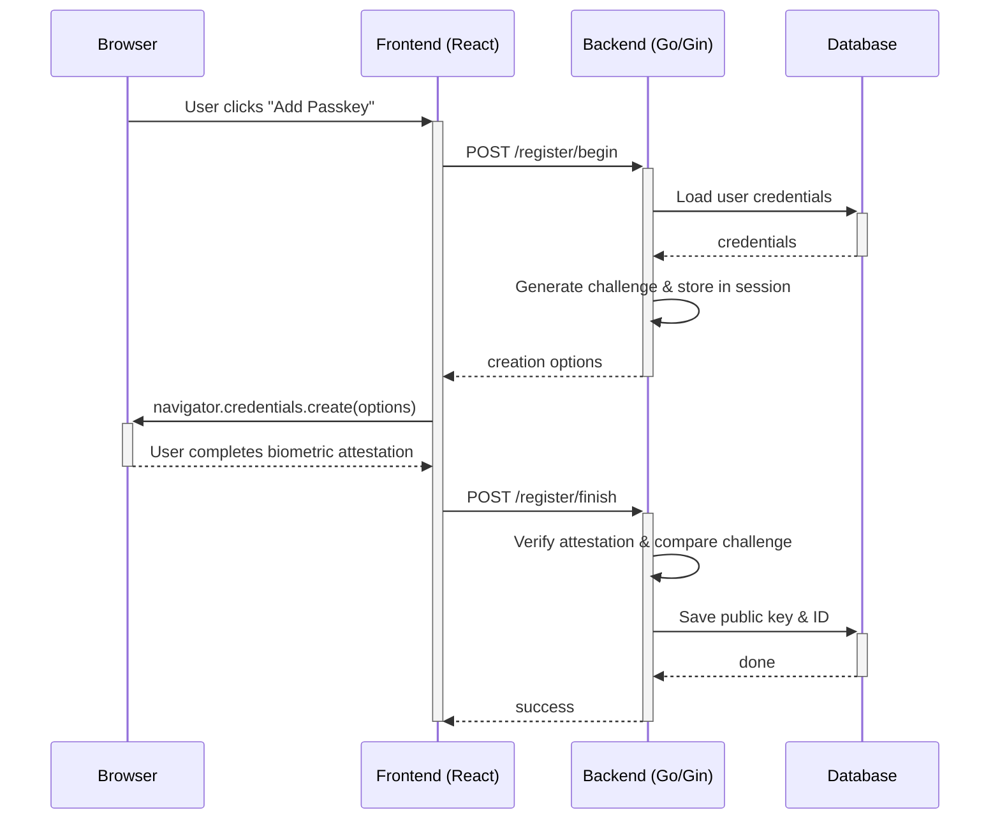
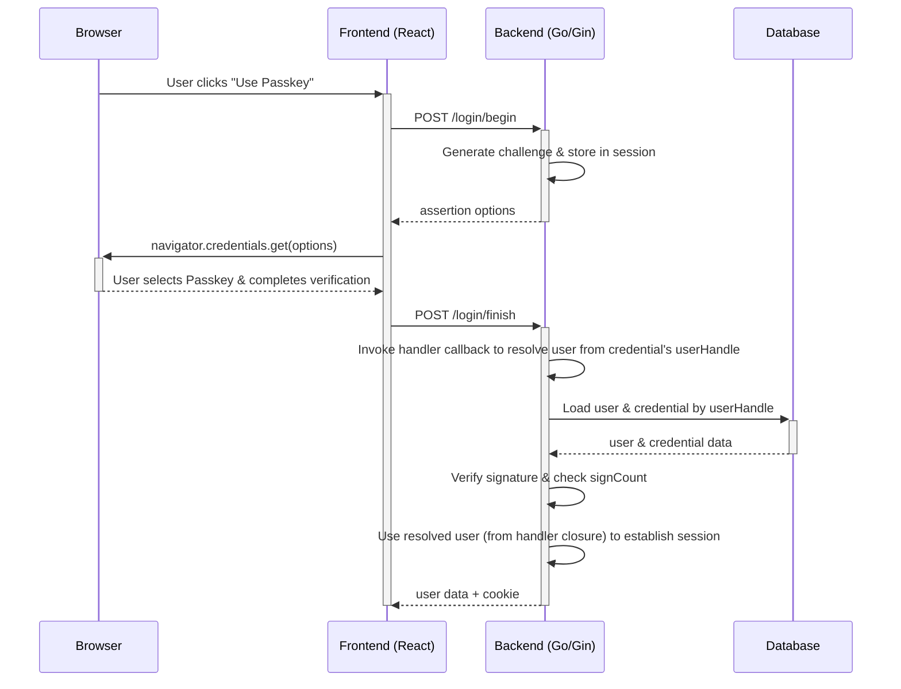

# Passkey (WebAuthn) Implementation & Integration Guide

## 1. Overview

This project implements Passkey (passwordless) authentication based on the **WebAuthn Level 3 / FIDO2** standard, allowing users to log in without a password using biometrics (fingerprint, face recognition), hardware security keys (YubiKey), or built-in platform authenticators.

### 1.1 Tech Stack

| Layer                 | Technology                                                      | Version |
| --------------------- | --------------------------------------------------------------- | ------- |
| Backend WebAuthn lib  | [go-webauthn/webauthn](https://github.com/go-webauthn/webauthn) | v0.16.1 |
| Frontend WebAuthn lib | [@simplewebauthn/browser](https://simplewebauthn.dev/)          | ^13.x   |
| Backend framework     | Gin (Go)                                                        | v1.12   |
| Frontend framework    | React + TypeScript                                              | 18.x    |
| Database ORM          | GORM                                                            | v1.31   |

### 1.2 Core Features

- **Discoverable Credentials**: Supports username-less login, browser automatically prompts with registered Passkeys
- **Multiple Credentials**: Each user can register multiple Passkeys (across devices)
- **Replay Attack Prevention**: Uses `signCount` increment to detect cloned authenticators
- **Cross-platform**: Supports USB security keys, Bluetooth, NFC, platform authenticators (Touch ID / Windows Hello / Android biometrics)

## 2. Architecture

### 2.1 Data Model

```
┌──────────────┐        1:N        ┌──────────────────────┐
│    users     │◄──────────────────│  passkey_credentials │
│              │                   │                      │
│  id (PK)     │                   │  id (PK)             │
│  username    │                   │  user_id (FK→users)  │
│  ...         │                   │  credential_name     │
└──────────────┘                   │  credential_id (UQ)  │
                                   │  public_key          │
                                   │  attestation_type    │
                                   │  aaguid              │
                                   │  sign_count          │
                                   │  backup_eligible     │
                                   │  backup_state        │
                                   │  transport           │
                                   │  created_at          │
                                   │  updated_at          │
                                   └──────────────────────┘
```

**Database table `passkey_credentials`** is auto-created by GORM AutoMigrate at startup, defined in:

- **Model**: `model/passkey.go` — `PasskeyCredential` struct
- **Migration**: `model/main.go` — registered in `migrateDB()` function

### 2.2 WebAuthn User Adapter

File `model/passkey_webauthn.go` defines the `WebAuthnUser` struct, implementing the `webauthn.User` interface:

```go
type WebAuthnUser struct {
    User        *User
    Credentials []*PasskeyCredential
}

// Implemented interface methods:
func (u *WebAuthnUser) WebAuthnID() []byte          // 8字节 BigEndian 编码的 user.Id
func (u *WebAuthnUser) WebAuthnName() string         // user.Username
func (u *WebAuthnUser) WebAuthnDisplayName() string  // user.DisplayName 或 Username
func (u *WebAuthnUser) WebAuthnCredentials() []webauthn.Credential
```

**UserHandle encoding**: `binary.BigEndian.PutUint64(buf, uint64(user.Id))`, fixed 8 bytes. Used in discoverable login's `userHandle` to locate the user.

## 3. API Endpoints

### 3.1 Public Endpoints (No Login Required)

| Method | Path                             | Description                                            |
| ------ | -------------------------------- | ------------------------------------------------------ |
| POST   | `/api/user/passkey/login/begin`  | Initiate Discoverable Login, returns assertion options |
| POST   | `/api/user/passkey/login/finish` | Complete login, verify signature and establish session |

### 3.2 Authenticated Endpoints (Login Required)

| Method | Path                                         | Description                                     |
| ------ | -------------------------------------------- | ----------------------------------------------- |
| GET    | `/api/user/passkey`                          | List all Passkeys for current user              |
| POST   | `/api/user/passkey/register/begin`           | Initiate registration, returns creation options |
| POST   | `/api/user/passkey/register/finish?name=xxx` | Complete registration, save credential          |
| DELETE | `/api/user/passkey/:id`                      | Delete specified Passkey                        |
| PUT    | `/api/user/passkey/:id`                      | Rename Passkey (`{ "name": "xxx" }`)            |

### 3.3 Registration Flow Sequence Diagram



### 3.4 Login Flow Sequence Diagram



## 4. Configuration

### 4.1 Environment Variables

| Variable              | Description                                         | Default                     |
| --------------------- | --------------------------------------------------- | --------------------------- |
| `WEBAUTHN_RP_ID`      | Relying Party ID, usually the domain (without port) | Parsed from `ServerAddress` |
| `WEBAUTHN_RP_ORIGINS` | Allowed origins, comma-separated                    | Parsed from `ServerAddress` |

Configuration is defined in `common/config/config.go`.

### 4.2 Production Deployment Example

```bash
# Your domain
export WEBAUTHN_RP_ID="api.example.com"

# Allowed origins (must include protocol, no path)
export WEBAUTHN_RP_ORIGINS="https://api.example.com"

# For multiple domains:
export WEBAUTHN_RP_ORIGINS="https://api.example.com,https://www.example.com"
```

### 4.3 Local Development

WebAuthn requires HTTPS, but `localhost` is specially exempted. No extra config needed for local development:

```bash
# Default ServerAddress is http://localhost:3000
# RP ID auto-parsed as "localhost"
# RP Origins auto-parsed as "http://localhost:3000"
```

## 5. Frontend Integration

### 5.1 Dependency

```bash
npm install @simplewebauthn/browser
```

### 5.2 Registration Flow (PersonalSettings.tsx)

```typescript
import { startRegistration, browserSupportsWebAuthn } from '@simplewebauthn/browser';

// 1. Check browser support
if (!browserSupportsWebAuthn()) {
  // Hide Passkey feature
  return;
}

// 2. Get registration options
// IMPORTANT: go-webauthn returns { publicKey: { challenge, rp, user, ... } }
// but @simplewebauthn/browser expects the inner publicKey object directly.
const beginRes = await api.post('/api/user/passkey/register/begin');

// 3. Call browser WebAuthn API — must pass .publicKey, not the wrapper object
const attResp = await startRegistration({ optionsJSON: beginRes.data.data.publicKey });

// 4. Send attestation to server
const finishRes = await api.post(`/api/user/passkey/register/finish?name=${encodeURIComponent(name)}`, attResp);
```

### 5.3 Login Flow (LoginPage.impl.tsx)

```typescript
import { startAuthentication } from '@simplewebauthn/browser';

// 1. Get assertion options
// IMPORTANT: go-webauthn returns { publicKey: { challenge, rpId, ... } }
// but @simplewebauthn/browser expects the inner publicKey object directly.
const beginRes = await api.post('/api/user/passkey/login/begin');

// 2. Call browser WebAuthn API — must pass .publicKey, not the wrapper object
const assertionResp = await startAuthentication({ optionsJSON: beginRes.data.data.publicKey });

// 3. Send assertion to server
const finishRes = await api.post('/api/user/passkey/login/finish', assertionResp);

// 4. Handle login result
if (finishRes.data.success) {
  login(finishRes.data.data, '');
  navigate('/dashboard');
}
```

### 5.4 UI Placement

- **Settings page**: `web/modern/src/pages/settings/PersonalSettings.tsx`
  - Passkey management card added below TOTP card
  - Includes: list registered Passkeys, add new Passkey, delete Passkey
- **Login page**: `web/modern/src/pages/auth/LoginPage.impl.tsx`
  - "Login with Passkey" button added below password login
  - Only shown if browser supports WebAuthn

## 6. Backend Implementation Details

### 6.1 File Structure

```text
controller/passkey.go           # HTTP 处理函数（注册/登录/管理）
model/passkey.go                # PasskeyCredential 数据模型和 CRUD
model/passkey_webauthn.go       # WebAuthn User 接口适配器
router/api.go                   # 路由注册
common/config/config.go         # WebAuthn 配置变量
```

### 6.2 WebAuthn Instance Initialization

`controller/passkey.go` uses `sync.Once` to lazily initialize a global `webauthn.WebAuthn` instance:

```go
var (
    webAuthnInstance *webauthn.WebAuthn
    webAuthnOnce     sync.Once
)

func getWebAuthn() (*webauthn.WebAuthn, error) {
    webAuthnOnce.Do(func() {
        cfg := &webauthn.Config{
            RPDisplayName: config.SystemName,
            RPID:          rpID,      // 从环境变量或 ServerAddress 解析
            RPOrigins:     rpOrigins, // 从环境变量或 ServerAddress 解析
        }
        webAuthnInstance, _ = webauthn.New(cfg)
    })
    return webAuthnInstance, webAuthnErr
}
```

### 6.3 Session Storage

WebAuthn ceremony challenge data is stored in Gin's cookie-based session:

- **Registration**: `webauthn_register_session` key
- **Login**: `webauthn_login_session` key

Data is serialized as JSON and stored in the session, read and deleted during the finish step.

**Important caveat for discoverable login**: `BeginDiscoverableLogin` does not know which user will authenticate, so `sessionData.UserID` is **empty** after deserialization. The user is resolved inside the `FinishDiscoverableLogin` handler callback (which receives the credential's `userHandle`). The finish handler must capture the resolved user via a closure variable — do **not** read `sessionData.UserID` to determine the logged-in user.

### 6.4 Security Considerations

1. **Origin validation**: go-webauthn library automatically validates `rpId` and `origin` match
2. **One-time challenge**: Each begin generates a new challenge, deleted after finish
3. **signCount increment check**: Updates sign_count after each successful authentication, library auto-detects cloning
4. **Backup flags tracking**: Stores `BackupEligible` (BE) and `BackupState` (BS) flags per credential; BS is updated after each login via `UpdatePasskeyAfterLogin`
5. **Resident Key requirement**: Set `ResidentKeyRequirementRequired` during registration to ensure discoverable credential
6. **Exclude existing credentials**: Use `excludeCredentials` during registration to prevent duplicate registration of the same authenticator
7. **User status check**: Verify user `Status == UserStatusEnabled` during login

## 7. i18n Translation

Translation file locations:

- **English**: `web/modern/src/i18n/locales/en/settings.json` → `personal_settings.passkey.*`
- **Chinese**: `web/modern/src/i18n/locales/zh/settings.json` → `personal_settings.passkey.*`
- **Login page**: `web/modern/src/i18n/locales/{en,zh}/auth.json` → `auth.login.passkey_*`

To add a new language, add the same key structure in the corresponding locale file.

## 8. Testing

### 8.1 Local Testing

1. Start the service (default `localhost:3000`)
2. Visit the login page using Chrome / Edge / Safari
3. Log in with password, go to **Settings → Personal Settings**
4. Click "Add Passkey" in the Passkey card
5. Browser prompts for biometric/security key, complete registration
6. Log out, click "Login with Passkey" on the login page

### 8.2 Cross-device Testing

- **Platform authenticators**: Touch ID (macOS), Windows Hello, Android fingerprint
- **Roaming authenticators**: YubiKey 5 (USB/NFC), Titan Security Key
- **Cross-device authentication**: Mobile as authenticator (via QR code scan)

### 8.3 API Testing

```bash
# Registration - begin (requires logged-in session cookie)
curl -X POST http://localhost:3000/api/user/passkey/register/begin \
  -H "Cookie: session=xxx"

# List registered passkeys
curl http://localhost:3000/api/user/passkey \
  -H "Cookie: session=xxx"

# Login - begin (no cookie needed)
curl -X POST http://localhost:3000/api/user/passkey/login/begin
```

## 9. Troubleshooting

| Issue                                                     | Cause                                                                                                                                  | Solution                                                                                                                                          |
| --------------------------------------------------------- | -------------------------------------------------------------------------------------------------------------------------------------- | ------------------------------------------------------------------------------------------------------------------------------------------------- |
| `Cannot read properties of undefined (reading 'replace')` | Frontend passes the raw go-webauthn response object to `@simplewebauthn/browser`, but the library expects the inner `publicKey` object | Pass `response.data.data.publicKey` (not `response.data.data`) as `optionsJSON` to `startRegistration` / `startAuthentication`. See §5.2 and §5.3 |
| "WebAuthn not available"                                  | `webauthn.New()` initialization failed                                                                                                 | Check `WEBAUTHN_RP_ID` and `WEBAUTHN_RP_ORIGINS` config                                                                                           |
| Browser does not prompt for authentication                | WebAuthn not supported or not HTTPS                                                                                                    | Use localhost or configure HTTPS                                                                                                                  |
| "registration failed: origin mismatch"                    | Frontend origin does not match backend config                                                                                          | Ensure `WEBAUTHN_RP_ORIGINS` includes the actual origin                                                                                           |
| "invalid user handle in session"                          | Code reads `sessionData.UserID` after discoverable login, but it is empty because `BeginDiscoverableLogin` doesn't know the user upfront | Resolve the user inside the `FinishDiscoverableLogin` handler callback and capture it via closure; never rely on `sessionData.UserID` for discoverable login. See §6.3 |
| "invalid user handle"                                     | userHandle in credential is shorter than 8 bytes                                                                                       | Check for DB ID encoding issues                                                                                                                   |
| Passkey option not shown on login                         | `browserSupportsWebAuthn()` returns false                                                                                              | Upgrade browser or use one that supports WebAuthn                                                                                                 |
| signCount not incrementing                                | Some authenticators do not support signCount                                                                                           | Normal, does not affect security                                                                                                                  |

## 10. References

- [WebAuthn Level 3 Specification (W3C)](https://www.w3.org/TR/webauthn-3/)
- [go-webauthn/webauthn GitHub](https://github.com/go-webauthn/webauthn)
- [SimpleWebAuthn Documentation](https://simplewebauthn.dev/)
- [Passkeys.dev - Implementation Guide](https://www.passkeys.com/guide)
- [FIDO Alliance - Passkey Resources](https://fidoalliance.org/passkeys/)
