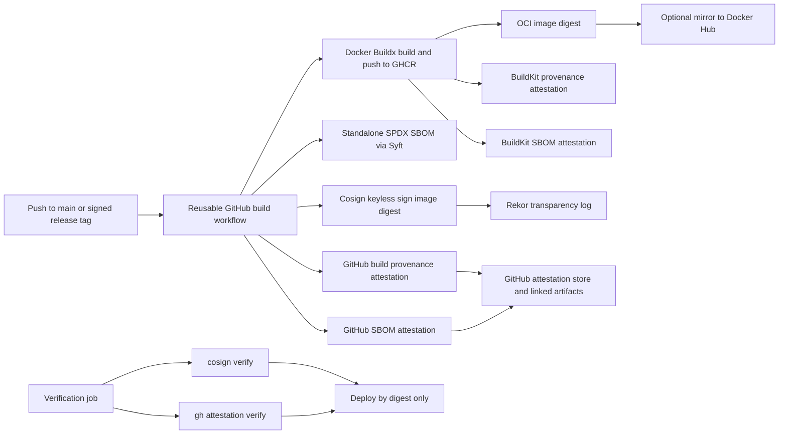

# Requirement: SBOM, SCA, Sigstore Container Signing, and Verifiable Release Pipeline

## Menu

- [Requirement: SBOM, SCA, Sigstore Container Signing, and Verifiable Release Pipeline](#requirement-sbom-sca-sigstore-container-signing-and-verifiable-release-pipeline)
  - [Menu](#menu)
  - [Summary](#summary)
  - [Current Gaps In This Repository](#current-gaps-in-this-repository)
  - [Goals](#goals)
  - [Non-Goals](#non-goals)
  - [Principles](#principles)
    - [1. Build Once, Promote By Digest](#1-build-once-promote-by-digest)
    - [2. Sign Identities, Not Just Bytes](#2-sign-identities-not-just-bytes)
    - [3. Verification Must Gate Delivery](#3-verification-must-gate-delivery)
    - [4. Use Short-Lived Identity, Not Long-Lived Secrets](#4-use-short-lived-identity-not-long-lived-secrets)
    - [5. SBOMs Exist At Multiple Layers](#5-sboms-exist-at-multiple-layers)
    - [6. Prefer Build-Time Evidence Over Post-Hoc Scanning](#6-prefer-build-time-evidence-over-post-hoc-scanning)
    - [7. Pin Inputs, Make Outputs Immutable](#7-pin-inputs-make-outputs-immutable)
    - [8. Avoid Secret Leakage In Provenance](#8-avoid-secret-leakage-in-provenance)
    - [9. Separate Canonical Registry From Mirror Registry](#9-separate-canonical-registry-from-mirror-registry)
    - [10. Favor Incremental Hardening](#10-favor-incremental-hardening)
  - [Target Architecture](#target-architecture)
  - [High-Level Flow](#high-level-flow)
  - [Canonical Artifact Model](#canonical-artifact-model)
  - [Trust Model](#trust-model)
    - [Canonical Trust Source](#canonical-trust-source)
    - [Mirror Registry](#mirror-registry)
    - [Signer Identity](#signer-identity)
    - [Storage And Audit Trail](#storage-and-audit-trail)
  - [Required Components](#required-components)
  - [CI/CD Components](#cicd-components)
    - [1. Canonical Container Release Workflow](#1-canonical-container-release-workflow)
    - [2. Reusable Binary Release Workflow](#2-reusable-binary-release-workflow)
    - [3. Verification Workflow Or Job](#3-verification-workflow-or-job)
    - [4. Deployment Workflow](#4-deployment-workflow)
  - [Tooling Components](#tooling-components)
    - [Docker Buildx And BuildKit](#docker-buildx-and-buildkit)
    - [GitHub Artifact Attestation Actions](#github-artifact-attestation-actions)
    - [Cosign](#cosign)
    - [Syft](#syft)
    - [GitHub Dependency Graph SBOM Export](#github-dependency-graph-sbom-export)
    - [SCA Baseline](#sca-baseline)
    - [Immutable Releases](#immutable-releases)
    - [Optional Higher-Assurance Components](#optional-higher-assurance-components)
  - [Recommended Workflow Topology](#recommended-workflow-topology)
  - [1. `pr.yml`](#1-pryml)
  - [2. `release-container.yml`](#2-release-containeryml)
  - [3. `release-binaries.yml`](#3-release-binariesyml)
  - [4. `deploy.yml`](#4-deployyml)
  - [Manual](#manual)
  - [Phase 0: Normalize The Supply Chain Before Signing](#phase-0-normalize-the-supply-chain-before-signing)
    - [Step 1. Choose The Canonical Image Name](#step-1-choose-the-canonical-image-name)
    - [Step 2. Remove Non-Reproducible Inputs](#step-2-remove-non-reproducible-inputs)
    - [Step 3. Enable GitHub Features](#step-3-enable-github-features)
    - [Step 4. Turn On SCA Baseline](#step-4-turn-on-sca-baseline)
    - [Step 5. Standardize Release Evidence](#step-5-standardize-release-evidence)
  - [Phase 1: Add Container Provenance And SBOM](#phase-1-add-container-provenance-and-sbom)
    - [Step 1. Build And Push With BuildKit Attestations](#step-1-build-and-push-with-buildkit-attestations)
    - [Step 2. Keep The Standalone SBOM](#step-2-keep-the-standalone-sbom)
  - [Phase 2: Add Sigstore Container Signing](#phase-2-add-sigstore-container-signing)
    - [Step 1. Sign The Canonical Digest](#step-1-sign-the-canonical-digest)
    - [Step 2. Verify In The Same Workflow](#step-2-verify-in-the-same-workflow)
    - [Step 3. Sign Mirror References Only If Needed](#step-3-sign-mirror-references-only-if-needed)
  - [Phase 3: Add Release Binary Provenance And SBOM](#phase-3-add-release-binary-provenance-and-sbom)
    - [Step 1. Build Stable Release Assets](#step-1-build-stable-release-assets)
    - [Step 2. Attest Checksummed Outputs](#step-2-attest-checksummed-outputs)
    - [Step 3. Generate Binary SBOMs](#step-3-generate-binary-sboms)
    - [Step 4. Optionally Sign Checksums As A Blob](#step-4-optionally-sign-checksums-as-a-blob)
    - [Step 5. Publish Immutable Releases](#step-5-publish-immutable-releases)
  - [Phase 4: Gate Deployment On Verification](#phase-4-gate-deployment-on-verification)
    - [Step 1. Pass The Verified Digest To Deploy](#step-1-pass-the-verified-digest-to-deploy)
    - [Step 2. Verify Before Pull](#step-2-verify-before-pull)
    - [Step 3. Pull And Run By Digest](#step-3-pull-and-run-by-digest)
  - [Phase 5: Increase Verifiability And Auditability Further](#phase-5-increase-verifiability-and-auditability-further)
    - [1. Export Repository Dependency SBOM Periodically](#1-export-repository-dependency-sbom-periodically)
    - [2. Submit Build-Resolved Dependencies When Needed](#2-submit-build-resolved-dependencies-when-needed)
    - [3. Adopt Reusable Trusted Builders](#3-adopt-reusable-trusted-builders)
    - [4. Move To Policy Enforcement If Deployment Evolves](#4-move-to-policy-enforcement-if-deployment-evolves)
  - [Verification Commands For Operators And Consumers](#verification-commands-for-operators-and-consumers)
  - [Verify Container Signature](#verify-container-signature)
  - [Verify Container Provenance](#verify-container-provenance)
  - [Verify Container SBOM Attestation](#verify-container-sbom-attestation)
  - [Extract OCI-Attached SBOM](#extract-oci-attached-sbom)
  - [Verify Immutable Release](#verify-immutable-release)
  - [Retention And Audit Record Requirements](#retention-and-audit-record-requirements)
  - [Acceptance Criteria](#acceptance-criteria)
  - [Implementation Order For This Repository](#implementation-order-for-this-repository)
  - [References](#references)


## Summary

`one-api` should publish verifiable release artifacts instead of only publishable artifacts.

As of March 7, 2026, the best-practice baseline for an OSS project with GitHub Actions based CI/CD is:

- Generate build-time provenance for every published artifact.
- Generate SBOMs for every published artifact.
- Run continuous Software Composition Analysis (SCA) on pull requests, the default branch, and published artifacts.
- Sign container images with Sigstore keyless signing via GitHub OIDC.
- Verify signatures and attestations before promotion or deployment.
- Publish immutable release records and keep an auditable chain from source commit to deployed digest.

For this repository, that means:

- Every published container image must have a digest, a signature, a provenance attestation, and an SBOM attestation.
- Every GitHub release asset must have checksums, provenance, and an SBOM.
- Dependency changes must be reviewed before merge and monitored continuously after merge.
- Deployment must consume verified digests, not mutable tags like `latest`.
- GHCR should become the canonical trust source, while Docker Hub can remain a mirror for convenience.

## Current Gaps In This Repository

After the legacy workflow cleanup, the repository currently keeps only `.github/workflows/ci.yml`, `.github/workflows/pr.yml`, and `.github/workflows/lint.yml`.

The current repository state still has several issues that reduce verifiability and auditability:

- `.github/workflows/ci.yml` publishes only `ppcelery/one-api` to Docker Hub. There is still no canonical GHCR publication path for signed and attested images.
- `.github/workflows/ci.yml` deploys by pulling `ppcelery/one-api:latest`. A mutable tag is not a safe deployment identifier.
- `Dockerfile` uses floating base image references, including `linuxserver/ffmpeg:latest`. Floating inputs weaken provenance and reproducibility.
- `Dockerfile` injects `date +%s` into the frontend build, which means the same source can produce different artifacts across builds.
- Tagged release logic is still mixed into `ci.yml`, and today it only publishes Windows binaries. Container, Linux, macOS, checksums, SBOM, and provenance release evidence are still missing from a dedicated release path.
- There is no explicit SCA control plane yet: no dependency review gate in `pr.yml`, no documented Dependabot policy, and no artifact-level vulnerability scan tied to the generated SBOMs.
- There is currently no image signing, no OCI-attached provenance, no OCI-attached SBOM, no release checksums, no release SBOMs, and no deployment-time verification step.

## Goals

- Establish a single canonical artifact identity for containers.
- Generate and publish verifiable provenance for containers and release binaries.
- Generate and publish SBOMs for runtime images, release binaries, and repository dependency inventory.
- Continuously detect known vulnerable dependencies before merge and after disclosure.
- Enforce deployment by digest only.
- Preserve an auditable record in GitHub attestations, OCI referrers, GitHub releases, and Rekor.
- Make verification simple for humans, automation, and downstream consumers.

## Non-Goals

- Running a private Sigstore deployment in phase 1.
- Achieving perfect byte-for-byte reproducible builds in the first iteration.
- Replacing the whole release pipeline before delivering initial signing and attestation coverage.

## Principles

### 1. Build Once, Promote By Digest

Build an artifact once, identify it by digest, and promote that exact digest across release and deployment stages.

Never treat a mutable tag such as `latest` as the source of truth.

### 2. Sign Identities, Not Just Bytes

The point of signing is not only integrity. It is to bind the artifact to:

- the repository
- the workflow that built it
- the source ref
- the transparency log entry

This is why keyless signing with GitHub OIDC and Sigstore is preferred over long-lived project-managed private keys for CI.

### 3. Verification Must Gate Delivery

Signing without verification is only metadata. The release and deploy paths must reject:

- unsigned digests
- wrong workflow identities
- missing provenance
- missing SBOM attestations

### 4. Use Short-Lived Identity, Not Long-Lived Secrets

Prefer GitHub OIDC based signing and attestation over stored private keys.

If a registry mirror still requires a static secret, that mirror should remain secondary and should not be the canonical trust source.

### 5. SBOMs Exist At Multiple Layers

No single SBOM answers every question.

- Repository dependency SBOM answers: what dependencies are declared in source control?
- Image SBOM answers: what packages and OS components are in the runtime artifact?
- Release asset SBOM answers: what is inside the shipped binary or archive?

An SBOM is inventory. SCA is the continuous process that uses that inventory, advisory data, and policy to decide whether a dependency change or artifact is acceptable.

### 6. Prefer Build-Time Evidence Over Post-Hoc Scanning

Build-time attestations are stronger than post-hoc reports because they are generated by the build system as part of artifact creation and can be bound to the artifact digest.

### 7. Pin Inputs, Make Outputs Immutable

For strong provenance, inputs must be stable and outputs must be immutable.

- Pin GitHub Actions by full commit SHA in implementation.
- Pin builder images and base images by digest.
- Pin Go and Node versions exactly.
- Enable immutable GitHub releases.

### 8. Avoid Secret Leakage In Provenance

Docker documents that build arguments can appear in provenance. Do not pass secrets through Docker `ARG` or plain build args. Use proper secret mounts instead.

### 9. Separate Canonical Registry From Mirror Registry

Use one canonical registry for trust and verification. Mirror elsewhere only for distribution convenience.

For this repository, GHCR is the best canonical choice because it integrates naturally with GitHub attestations and linked artifacts.

### 10. Favor Incremental Hardening

The right rollout order is:

1. Normalize artifact identity.
2. Add provenance and SBOM generation.
3. Add signing.
4. Add verification gates.
5. Enforce stronger policy at deploy time.

## Target Architecture

## High-Level Flow



## Canonical Artifact Model

| Subject                         | Format                         | Primary Location                               | Verification Tooling                                        |
| ------------------------------- | ------------------------------ | ---------------------------------------------- | ----------------------------------------------------------- |
| Container image                 | OCI image index                | `ghcr.io/<owner>/one-api`                      | `cosign verify`, `gh attestation verify`                    |
| Container build provenance      | in-toto SLSA provenance        | GHCR OCI referrer and GitHub attestation store | `gh attestation verify`                                     |
| Container SBOM                  | SPDX JSON attestation          | GHCR OCI referrer and GitHub attestation store | `gh attestation verify`, `docker buildx imagetools inspect` |
| Standalone image SBOM           | SPDX JSON file                 | workflow artifact and release asset            | diff tools, scanners, auditors                              |
| Release binaries                | files plus checksums           | GitHub Releases                                | `gh release verify`, `gh release verify-asset`              |
| Binary provenance               | in-toto SLSA provenance        | GitHub attestation store                       | `gh attestation verify`                                     |
| Binary SBOM                     | SPDX JSON file and attestation | GitHub attestation store and release assets    | `gh attestation verify`                                     |
| Repository dependency inventory | SPDX JSON                      | GitHub dependency graph export                 | audit/compliance tooling                                    |

## Trust Model

### Canonical Trust Source

Use GHCR as the canonical image registry for signed and attested artifacts.

Reasons:

- GitHub can store and expose linked artifacts for container subjects.
- `actions/attest-build-provenance` supports pushing attestations to the registry.
- GitHub CLI verification integrates naturally with GitHub repository identity.
- The same platform already hosts the source repository and release workflows.

### Mirror Registry

Docker Hub may remain as a mirror, but:

- it should not be the canonical source for deployment
- its tags should match the canonical digest
- if it is used directly by consumers, sign that reference too

### Signer Identity

All production verification policy should pin:

- repository: `<owner>/one-api`
- workflow path: for example `.github/workflows/release-container.yml`
- OIDC issuer: `https://token.actions.githubusercontent.com`
- source ref: `refs/heads/main` for continuous builds or `refs/tags/v*` for releases

### Storage And Audit Trail

The architecture should preserve evidence in several places:

- OCI registry referrers for container-related attestations
- GitHub attestation store for repository-linked provenance and SBOM records
- Rekor transparency log for Sigstore signature transparency
- GitHub immutable releases for released binaries and checksums

## Required Components

## CI/CD Components

### 1. Canonical Container Release Workflow

A single workflow should own container publication for both `main` and tagged releases.

Recommended responsibilities:

- build multi-arch container image
- push to GHCR
- optionally mirror to Docker Hub
- emit digest outputs
- generate provenance and SBOM
- sign the image digest
- verify the signature and attestations before marking the job green

### 2. Reusable Binary Release Workflow

A reusable workflow should build Linux, macOS, and Windows artifacts with stable toolchains and emit:

- binaries
- SHA256 checksums
- provenance attestation
- SBOMs

### 3. Verification Workflow Or Job

A dedicated verification stage should:

- verify the Sigstore signature
- verify GitHub provenance attestation
- verify GitHub SBOM attestation
- fail if the artifact is referenced by tag instead of digest

### 4. Deployment Workflow

Deployment should consume:

- a verified digest from GHCR
- a recorded workflow run URL
- the exact commit SHA and tag associated with that digest

The current SSH deployment step should be updated so it never performs `docker pull ...:latest`.

## Tooling Components

### Docker Buildx And BuildKit

Use Docker Buildx with:

- `provenance: mode=max`
- `sbom: true`
- direct push to registry

### GitHub Artifact Attestation Actions

Use:

- `actions/attest-build-provenance`
- `actions/attest-sbom`

Required permissions for the container workflow:

- `id-token: write`
- `attestations: write`
- `artifact-metadata: write`
- `packages: write`
- `contents: read`

### Cosign

Use `sigstore/cosign-installer` and keyless signing with GitHub OIDC.

Sign the image digest, never only the tag.

### Syft

Use `anchore/sbom-action` or plain `syft` to create standalone SPDX JSON SBOM files for:

- pushed images by digest
- release binaries

The standalone SBOM should exist even if BuildKit already attached an SBOM to the image. The attached SBOM is best for consumers. The standalone file is best for archival, diffs, and external scanners.

### GitHub Dependency Graph SBOM Export

Use GitHub dependency graph export to generate a repository-level SPDX SBOM. This is supplemental evidence, not a replacement for build-time image or binary SBOMs.

### SCA Baseline

Use layered SCA rather than a single scanner:

- GitHub dependency graph plus dependency review for PR-time visibility on manifest and lockfile changes.
- Dependabot alerts and Dependabot security updates for newly disclosed vulnerabilities on the default branch.
- `govulncheck ./...` in PR and CI because this repository is Go-first and `govulncheck` is call-aware.
- One SBOM-capable artifact scanner for published images and release SBOMs, preferably run from the generated SPDX SBOM so findings are tied to release evidence.

GitHub-native SCA is strongest for source dependency changes. SBOM-fed SCA is strongest for built artifacts. This repository should use both.

### Immutable Releases

Enable GitHub immutable releases so published tags and release assets cannot be changed after publication.

### Optional Higher-Assurance Components

- GitHub reusable builder workflows to move closer to SLSA Build L3 style isolation and signer pinning.
- Sigstore policy-controller or GitHub Kubernetes admission controller if the project later deploys to Kubernetes.
- OpenSSF Scorecard in CI to continuously measure supply chain posture.
- `gitsign` for maintainer commit and tag signing.
- Rekor monitoring for this repository's workflow identities.

## Recommended Workflow Topology

## 1. `pr.yml`

Keep this as the pre-merge quality gate and add:

- workflow action pinning checks
- policy checks that release workflows are not modified without review
- dependency review with `actions/dependency-review-action`
- `govulncheck ./...` or equivalent Go vulnerability analysis

## 2. `release-container.yml`

Create a new canonical container workflow by splitting the current container build and deploy responsibilities out of `ci.yml`.

This workflow should publish:

- `ghcr.io/<owner>/one-api:<tag>`
- `ghcr.io/<owner>/one-api:sha-<shortsha>`
- optional `index.docker.io/<namespace>/one-api:<tag>`
- optional `index.docker.io/<namespace>/one-api:sha-<shortsha>`

## 3. `release-binaries.yml`

Consolidate Linux, macOS, and Windows release asset builds behind one reusable pattern and publish:

- platform archives or binaries
- `checksums.txt`
- provenance
- SBOMs

## 4. `deploy.yml`

Deploy by digest only, after verification. If a digest is not available, deployment must fail.

## Manual

## Phase 0: Normalize The Supply Chain Before Signing

### Step 1. Choose The Canonical Image Name

Pick one canonical image identity and keep it stable.

Recommended:

- canonical: `ghcr.io/<owner>/one-api`
- mirror: `index.docker.io/<namespace>/one-api`

Because the live workflow currently publishes `ppcelery/one-api`, the migration to GHCR should be explicit:

- decide whether `ppcelery/one-api` stays as a mirror or is retired
- publish the same digest to both registries during migration if compatibility is required
- update deployment and documentation to treat only one registry as canonical

### Step 2. Remove Non-Reproducible Inputs

Before signatures are added, reduce avoidable build drift:

- replace `linuxserver/ffmpeg:latest` with a digest-pinned image
- pin `node` and `golang` builder images by digest
- replace timestamp-based frontend versioning with commit SHA, tag, or `SOURCE_DATE_EPOCH`
- pin GitHub Actions to full commit SHAs in the actual workflow implementation
- replace any remaining version ranges or floating tool selectors with exact toolchain versions

### Step 3. Enable GitHub Features

Enable:

- dependency graph
- dependency review
- Dependabot alerts
- Dependabot security updates
- artifact attestations
- linked artifacts support through `artifact-metadata: write`
- immutable releases
- branch protection for `main`
- protected release tag rules if available in the hosting plan

### Step 4. Turn On SCA Baseline

Add an explicit SCA baseline before signing rollout:

- enable `actions/dependency-review-action` in `pr.yml`
- enable Dependabot alerts at the repository or organization level
- add `.github/dependabot.yml` for `gomod` and each maintained frontend package manifest directory
- keep `govulncheck ./...` as a required CI check and fail on actionable findings
- run one SBOM-fed vulnerability scan for published images or generated SPDX files and store the results as workflow artifacts

Because this repository contains multiple frontend templates, SCA coverage should include every maintained package directory or explicitly document why a directory is excluded.

### Step 5. Standardize Release Evidence

Every release should eventually include:

- source commit SHA
- workflow run URL
- image digest
- checksums file
- SBOM files
- provenance attestation identifiers

## Phase 1: Add Container Provenance And SBOM

### Step 1. Build And Push With BuildKit Attestations

Use a container workflow like:

```yaml
name: release-container

on:
  push:
    branches: [main]
    tags: ['v*.*.*']

permissions:
  contents: read
  packages: write
  id-token: write
  attestations: write
  artifact-metadata: write

jobs:
  release:
    runs-on: ubuntu-latest
    env:
      IMAGE_NAME: ghcr.io/<owner>/one-api
    steps:
      - name: Checkout
        uses: actions/checkout@v5
        with:
          persist-credentials: false

      - name: Set up QEMU
        uses: docker/setup-qemu-action@v3

      - name: Set up Buildx
        uses: docker/setup-buildx-action@v3

      - name: Log in to GHCR
        uses: docker/login-action@v3
        with:
          registry: ghcr.io
          username: ${{ github.actor }}
          password: ${{ secrets.GITHUB_TOKEN }}

      - name: Metadata
        id: meta
        uses: docker/metadata-action@v5
        with:
          images: ${{ env.IMAGE_NAME }}

      - name: Build and push
        id: build
        uses: docker/build-push-action@v6
        with:
          context: .
          push: true
          platforms: linux/amd64,linux/arm64
          tags: ${{ steps.meta.outputs.tags }}
          labels: ${{ steps.meta.outputs.labels }}
          provenance: mode=max
          sbom: true

      - name: Attest build provenance
        uses: actions/attest-build-provenance@v3
        with:
          subject-name: ${{ env.IMAGE_NAME }}
          subject-digest: ${{ steps.build.outputs.digest }}
          push-to-registry: true

      - name: Generate standalone SPDX SBOM
        uses: anchore/sbom-action@v0
        with:
          image: ${{ env.IMAGE_NAME }}@${{ steps.build.outputs.digest }}
          format: spdx-json
          output-file: image.spdx.json

      - name: Attest SBOM
        uses: actions/attest-sbom@v3
        with:
          subject-name: ${{ env.IMAGE_NAME }}
          subject-digest: ${{ steps.build.outputs.digest }}
          sbom-path: image.spdx.json
          push-to-registry: true
```

Implementation notes:

- `subject-name` for container attestations must be the fully-qualified image name without a tag.
- If attesting a Docker Hub image through GitHub's attestation action, use `index.docker.io/...` as the registry portion.
- Do not use `load: true` for the final published image path because local image store paths do not preserve attestations in the normal Docker engine image store.

### Step 2. Keep The Standalone SBOM

Upload `image.spdx.json` as:

- a workflow artifact on every signed publish
- a GitHub release asset for version tags

This file is useful for code review and diffing, external vulnerability scanners, and offline audit evidence.

## Phase 2: Add Sigstore Container Signing

### Step 1. Sign The Canonical Digest

After the image is pushed, install Cosign and sign the digest:

```yaml
- name: Install Cosign
  uses: sigstore/cosign-installer@v4

- name: Sign image digest
  env:
    IMAGE_DIGEST: ${{ steps.build.outputs.digest }}
    IMAGE_NAME: ${{ env.IMAGE_NAME }}
  run: cosign sign --yes ${IMAGE_NAME}@${IMAGE_DIGEST}
```

### Step 2. Verify In The Same Workflow

Fail fast if the signature is not immediately verifiable:

```yaml
- name: Verify image signature
  env:
    IMAGE_DIGEST: ${{ steps.build.outputs.digest }}
    IMAGE_NAME: ${{ env.IMAGE_NAME }}
  run: >
    cosign verify ${IMAGE_NAME}@${IMAGE_DIGEST}
    --certificate-identity-regexp='^https://github.com/<owner>/one-api/.github/workflows/release-container.yml@refs/(heads/main|tags/v.*)$'
    --certificate-oidc-issuer=https://token.actions.githubusercontent.com
```

### Step 3. Sign Mirror References Only If Needed

If Docker Hub remains in use as a direct consumer endpoint, sign the Docker Hub digest reference as well.

If Docker Hub is only a convenience mirror and deployment always uses GHCR, GHCR signing alone is sufficient for the canonical chain of trust.

## Phase 3: Add Release Binary Provenance And SBOM

### Step 1. Build Stable Release Assets

For Linux, macOS, and Windows release assets:

- pin exact Go and Node versions
- use `-trimpath`
- avoid timestamp-derived values in output names unless they are part of a declared release process
- generate `checksums.txt`

### Step 2. Attest Checksummed Outputs

Use `actions/attest-build-provenance` with `subject-checksums` or explicit paths for all release assets.

Recommended release evidence:

- `one-api-linux-amd64`
- `one-api-linux-arm64`
- `one-api-macos-amd64`
- `one-api-windows-amd64.exe`
- `checksums.txt`

### Step 3. Generate Binary SBOMs

Generate SPDX JSON SBOMs for each binary or platform archive and attest them with `actions/attest-sbom`.

### Step 4. Optionally Sign Checksums As A Blob

If downstream consumers fetch binaries outside GitHub's attestation flow, add:

```bash
cosign sign-blob checksums.txt --bundle checksums.sigstore.json --yes
```

### Step 5. Publish Immutable Releases

Publish GitHub releases as:

1. draft release
2. attach binaries, checksums, SBOMs
3. publish immutable release

## Phase 4: Gate Deployment On Verification

### Step 1. Pass The Verified Digest To Deploy

The deploy job should receive a digest such as:

```text
ghcr.io/<owner>/one-api@sha256:<digest>
```

It should never infer the artifact from `latest`.

### Step 2. Verify Before Pull

Recommended deploy-time verification:

```bash
IMAGE="ghcr.io/<owner>/one-api@sha256:<digest>"

cosign verify "$IMAGE" \
  --certificate-identity-regexp '^https://github.com/<owner>/one-api/.github/workflows/release-container.yml@refs/(heads/main|tags/v.*)$' \
  --certificate-oidc-issuer https://token.actions.githubusercontent.com

gh attestation verify "oci://$IMAGE" \
  --repo <owner>/one-api \
  --signer-workflow <owner>/one-api/.github/workflows/release-container.yml

gh attestation verify "oci://$IMAGE" \
  --repo <owner>/one-api \
  --predicate-type https://spdx.dev/Document/v2.3
```

Notes:

- `gh attestation verify` verifies provenance by default.
- For SBOM attestations, the `--predicate-type` flag is required.
- If a reusable workflow becomes the signer of record, pin that reusable workflow in verification policy.

### Step 3. Pull And Run By Digest

Only after successful verification:

```bash
docker pull "$IMAGE"
docker compose up -d
```

The deployment record should persist:

- the digest
- the Git tag or commit SHA
- the workflow run URL
- the timestamp of verification

## Phase 5: Increase Verifiability And Auditability Further

### 1. Export Repository Dependency SBOM Periodically

Generate a repository-level SPDX SBOM from the GitHub dependency graph for audit and compliance snapshots:

```bash
gh api repos/<owner>/one-api/dependency-graph/sbom > repo-deps.spdx.json
```

This is useful for:

- declared dependency review
- change audits across releases
- compliance reporting
- feeding periodic SCA snapshots for default-branch review

### 2. Submit Build-Resolved Dependencies When Needed

If GitHub cannot fully infer transitive dependencies from manifests alone, submit build-resolved dependencies or SBOM snapshots to the dependency submission API so Dependabot alerts and dependency review see the same dependency picture that CI actually built.

### 3. Adopt Reusable Trusted Builders

GitHub recommends reusable workflows for stronger builder identity and better SLSA verification. Use a reusable workflow for container builds and binary builds so verifiers can pin `--signer-workflow` to a trusted build entrypoint.

### 4. Move To Policy Enforcement If Deployment Evolves

If deployment later moves to Kubernetes, enforce provenance and attestation policy with Sigstore policy-controller or GitHub's admission-controller based flow.

## Verification Commands For Operators And Consumers

## Verify Container Signature

```bash
cosign verify ghcr.io/<owner>/one-api@sha256:<digest> \
  --certificate-identity-regexp '^https://github.com/<owner>/one-api/.github/workflows/release-container.yml@refs/tags/v.*$' \
  --certificate-oidc-issuer https://token.actions.githubusercontent.com
```

## Verify Container Provenance

```bash
gh attestation verify oci://ghcr.io/<owner>/one-api@sha256:<digest> \
  --repo <owner>/one-api \
  --signer-workflow <owner>/one-api/.github/workflows/release-container.yml
```

## Verify Container SBOM Attestation

```bash
gh attestation verify oci://ghcr.io/<owner>/one-api@sha256:<digest> \
  --repo <owner>/one-api \
  --predicate-type https://spdx.dev/Document/v2.3
```

## Extract OCI-Attached SBOM

```bash
docker buildx imagetools inspect ghcr.io/<owner>/one-api@sha256:<digest> \
  --format '{{ json .SBOM }}' > image.spdx.json
```

## Verify Immutable Release

```bash
gh release verify vX.Y.Z
gh release verify-asset vX.Y.Z ./one-api-linux-amd64
```

## Retention And Audit Record Requirements

For each tagged release, retain:

- container digest
- image signature verification result
- provenance attestation ID or bundle path
- SBOM attestation ID or bundle path
- standalone SBOM files
- release checksums
- release asset provenance attestation ID
- workflow run URL
- commit SHA and tag

The audit trail should make it possible to answer:

- which workflow built this artifact?
- from which commit and tag?
- which exact digest was deployed?
- which SBOM matched that digest?
- who verified it and when?

## Acceptance Criteria

- A release container image published by this repository can be verified by digest with `cosign verify`.
- The same image has a GitHub build provenance attestation verifiable with `gh attestation verify`.
- The same image has an SBOM attestation verifiable with `gh attestation verify --predicate-type https://spdx.dev/Document/v2.3`.
- A standalone SPDX SBOM file is attached as workflow evidence and release evidence.
- Pull requests that add or change dependencies are gated by dependency review and Go vulnerability analysis.
- Dependabot alerts and security updates are enabled for supported ecosystems in this repository.
- GitHub releases are immutable and contain binaries, checksums, and SBOMs.
- Deployment consumes a verified digest from GHCR, not `latest`.
- A repository dependency SBOM can be exported from GitHub for audit purposes.

## Implementation Order For This Repository

The recommended order of work is:

1. Create a single canonical container publication workflow and pick GHCR as the trust source.
2. Pin floating base images, GitHub Actions, and toolchain versions.
3. Remove timestamp-derived frontend build metadata from the Docker build path.
4. Add the SCA baseline: dependency review, Dependabot policy, and required `govulncheck`.
5. Add BuildKit provenance and SBOM generation for containers.
6. Add standalone SPDX SBOM generation with Syft and attest it.
7. Add Cosign keyless signing and same-workflow verification.
8. Add binary checksums, binary provenance, and binary SBOMs.
9. Change deployment to verify and pull by digest only.
10. Enable immutable releases, repository SBOM export, and periodic artifact-level SCA.
11. Add governance hardening such as Scorecard, reusable trusted builders, and optional `gitsign`.

## References

- Docker Docs: Add SBOM and provenance attestations with GitHub Actions - https://docs.docker.com/build/ci/github-actions/attestations/
- Docker Docs: SBOM attestations - https://docs.docker.com/build/metadata/attestations/sbom/
- Docker Docs: Build attestations - https://docs.docker.com/build/metadata/attestations/
- Sigstore Docs: CI quickstart - https://docs.sigstore.dev/quickstart/quickstart-ci/
- Sigstore Docs: Rekor overview - https://docs.sigstore.dev/logging/overview/
- Sigstore Docs: OIDC usage in Fulcio - https://docs.sigstore.dev/certificate_authority/oidc-in-fulcio/
- GitHub Docs: Using artifact attestations to establish provenance for builds - https://docs.github.com/actions/security-for-github-actions/using-artifact-attestations/using-artifact-attestations-to-establish-provenance-for-builds
- GitHub Action: `actions/attest-build-provenance` - https://github.com/actions/attest-build-provenance
- GitHub Action: `actions/attest-sbom` - https://github.com/actions/attest-sbom
- GitHub Docs: Immutable releases - https://docs.github.com/en/code-security/supply-chain-security/understanding-your-software-supply-chain/immutable-releases
- GitHub Docs: Dependency review - https://docs.github.com/en/code-security/supply-chain-security/understanding-your-software-supply-chain/about-dependency-review
- GitHub Docs: About the dependency graph - https://docs.github.com/en/code-security/supply-chain-security/understanding-your-software-supply-chain/about-the-dependency-graph
- GitHub Docs: Dependabot alerts - https://docs.github.com/code-security/supply-chain-security/managing-vulnerabilities-in-your-projects-dependencies/about-alerts-for-vulnerable-dependencies?learn=dependabot_alerts
- GitHub Docs: Dependabot security updates - https://docs.github.com/code-security/dependabot/dependabot-security-updates/configuring-dependabot-security-updates
- GitHub Docs: REST API endpoint for exporting repository SBOM - https://docs.github.com/en/rest/dependency-graph/sboms
- GitHub Docs: REST API endpoints for dependency submission - https://docs.github.com/en/rest/dependency-graph/dependency-submission
- Go Docs: `govulncheck` - https://pkg.go.dev/golang.org/x/vuln/cmd/govulncheck
- OSV-Scanner Docs - https://google.github.io/osv-scanner/
- SLSA: Provenance - https://slsa.dev/spec/v1.1/provenance
