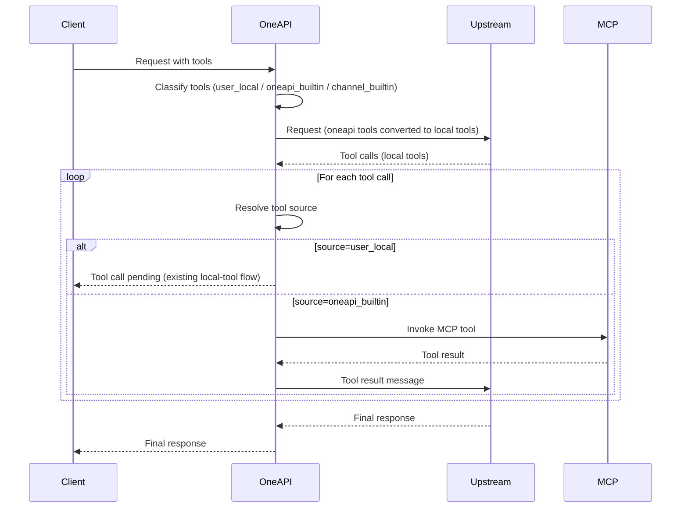

# Requirement: MCP Aggregator Management Layer

# Menu

- [Requirement: MCP Aggregator Management Layer](#requirement-mcp-aggregator-management-layer)
- [Menu](#menu)
  - [Summary](#summary)
  - [Tool Taxonomy \& Compatibility Contract](#tool-taxonomy--compatibility-contract)
    - [Tool categories (internal)](#tool-categories-internal)
    - [Compatibility contract for downstream clients](#compatibility-contract-for-downstream-clients)
    - [Tool source tagging](#tool-source-tagging)
  - [Feasibility Analysis (based on current codebase)](#feasibility-analysis-based-on-current-codebase)
    - [Existing building blocks we can extend](#existing-building-blocks-we-can-extend)
    - [Missing pieces to implement](#missing-pieces-to-implement)
    - [Fit with architecture](#fit-with-architecture)
  - [Goals](#goals)
  - [Non‑Goals](#nongoals)
  - [User Stories](#user-stories)
    - [Admin](#admin)
    - [End User](#end-user)
    - [System](#system)
  - [Functional Requirements](#functional-requirements)
    - [0) Tool Orchestration \& Multi‑Round Execution](#0-tool-orchestration--multiround-execution)
      - [Routing rules](#routing-rules)
      - [Required internal mapping](#required-internal-mapping)
      - [Execution loop (per request)](#execution-loop-per-request)
      - [Tool call result handling](#tool-call-result-handling)
      - [Safety \& limits](#safety--limits)
      - [Mermaid: tool call loop](#mermaid-tool-call-loop)
    - [1) MCP Server Registry](#1-mcp-server-registry)
      - [MCP Server Fields](#mcp-server-fields)
      - [Validation](#validation)
    - [2) Tool Catalog \& Sync](#2-tool-catalog--sync)
      - [Tool availability policy resolution (server + channel + user)](#tool-availability-policy-resolution-server--channel--user)
      - [Automatic background sync](#automatic-background-sync)
    - [3) Built‑in Tool Exposure in Requests](#3-builtin-tool-exposure-in-requests)
    - [4) Billing Integration](#4-billing-integration)
    - [5) Logging](#5-logging)
    - [6) Public MCP Server Endpoint](#6-public-mcp-server-endpoint)
  - [API Requirements](#api-requirements)
    - [Admin MCP Management](#admin-mcp-management)
    - [Tool Catalog](#tool-catalog)
    - [MCP Proxy Server](#mcp-proxy-server)
    - [Logging and Billing Extensions](#logging-and-billing-extensions)
  - [UI/Pages Requirements (Modern Template)](#uipages-requirements-modern-template)
    - [Navigation](#navigation)
    - [Pages](#pages)
    - [Permission Rules](#permission-rules)
  - [Data Model (Proposed)](#data-model-proposed)
  - [Integration Flow (High Level)](#integration-flow-high-level)
  - [Edge Cases \& Error Handling](#edge-cases--error-handling)
  - [Telemetry \& Observability](#telemetry--observability)
  - [Testing Requirements](#testing-requirements)
  - [References](#references)

## Summary

Build a first‑class MCP aggregation layer that lets administrators register multiple remote MCP Servers and expose their tools to end users as built‑in tools, with unified policy control, billing, and logging. The solution must fit the existing one‑api routing, tool policy, and billing pipeline without breaking current built‑in tools (e.g., web search) or Response/Claude conversions. One‑api must differentiate three tool categories internally: user‑defined local tools, upstream channel built‑in tools, and one‑api built‑in tools aggregated from MCP servers. For downstream users, upstream built‑ins and one‑api built‑ins appear identical, but one‑api must handle them differently in the orchestration pipeline.

## Tool Taxonomy & Compatibility Contract

### Tool categories (internal)

1. **User‑defined local tools**

   - Provided directly in user requests (OpenAI tools/functions, Claude tools).
   - Executed by the user’s own tool executor, not by one‑api.

2. **Upstream channel built‑in tools**

   - Tools natively supported by the target upstream model/provider (e.g., web search).
   - Validated and billed using existing tooling policy (`relay/tooling/tools.go`).

3. **One‑api built‑in tools (MCP aggregated)**
   - Tools sourced from admin‑registered MCP servers.
   - Exposed to users as built‑ins, but executed by one‑api via MCP.

### Compatibility contract for downstream clients

- Users submit tool definitions normally (ChatCompletion/Response/Claude).
- Upstream built‑ins and one‑api built‑ins appear identical to the client (same tool schema / invocation semantics).
- One‑api must **separate upstream built‑ins vs one‑api built‑ins before dispatching to upstream**.
- One‑api must **convert one‑api built‑ins into local tool definitions** when sending requests upstream, so upstream models request tool calls in standard local‑tool form.

### Tool source tagging

One‑api must tag tool sources in its internal tool registry and per‑request tool map:

- `source=user_local` for user‑provided tools.
- `source=channel_builtin` for upstream provider tools.
- `source=oneapi_builtin` for MCP aggregated tools.

This tagging drives routing, billing, and the tool‑execution loop.

## Feasibility Analysis (based on current codebase)

### Existing building blocks we can extend

1. Built‑in tool policy and pricing already exist.

- Channel‑level tooling whitelist and pricing are stored in `Channel.Config` as `tooling` (see model/channel.go and controller/channel.go).
- The relay tooling pipeline (`relay/tooling/tools.go`) validates tool usage and applies per‑tool costs via `ToolUsageSummary`, which is already integrated into billing and logging (`model/log.go`, `relay/controller/helper.go`).

2. Request/response tool schema already supports MCP as a tool type.

- `relay/model/tool.go` defines MCP fields (`type=mcp`, `server_label`, `server_url`, `headers`, `allowed_tools`).
- Response API conversion already passes through MCP tools (`relay/controller/response_convert.go`).

3. Logging and billing pipelines can carry tool usage metadata.

- `ToolUsageSummary` is appended to log metadata and included in billing detail.
- Log UI already reads metadata and can be extended to show MCP tool usage.

### Missing pieces to implement

1. A persistent MCP Server registry (database model, API, UI, admin flows).
2. A pluggable MCP client for Streamable HTTP (and future protocols) to list tools and invoke them on behalf of users.
3. A tool catalog and policy resolution layer to map MCP server tools into built‑in tools for requests.
4. Tool usage tracking for MCP tool calls (counts + cost) and integration with billing/log metadata.
5. A public `/mcp` endpoint that exposes a local Streamable HTTP MCP server, backed by the configured MCP tools and pricing.

### Fit with architecture

This is feasible with minimal disruption by treating MCP tools as another built‑in tool source, similar to existing provider defaults + channel overrides. The relay tooling pipeline already supports a policy + pricing merge. We can extend it to include MCP registry‑based tools and pricing before validation and billing. No major changes are required to the model conversion layers; MCP tools are already representable in request/response DTOs.

## Goals

1. Admins can add/edit/delete MCP Servers.
2. MCP Servers publish tools that can be exposed to users as built‑in tools.
3. Admins can whitelist/blacklist tools and set per‑tool fees (override remote fees).
4. Billing and logs reflect MCP tool usage and costs.
5. The system provides `/mcp` Streamable HTTP endpoint for downstream MCP clients.

## Non‑Goals

1. Building MCP Server UIs for third‑party providers.
2. Automatic account creation or billing integration with upstream MCP providers.
3. Replacing existing provider built‑in tools (e.g., web search) or breaking Response/Claude conversions.

## User Stories

### Admin

1. As an admin, I can register an MCP Server by name and base URL so its tools are visible in one‑api.
2. As an admin, I can configure authentication for an MCP Server (API key/token, custom headers) so calls are authorized.
3. As an admin, I can choose the MCP protocol type (Streamable HTTP now, other types later) so the system is extensible.
4. As an admin, I can set tool allow/deny rules and per‑tool pricing overrides so I control cost and exposure.
5. As an admin, I can refresh a server’s tool catalog to sync with upstream changes.
6. As an admin, I can view MCP tool usage and cost in logs, including per‑tool breakdown.

### End User

1. As a user, I can call MCP tools in ChatCompletion/Response/Claude requests using the standard tool interface.
2. As a user, I only see and can call the MCP tools I’m authorized to use.
3. As a user, I can query my logs and see MCP tool charges associated with each request.

### System

1. As a system, I must reject MCP tool calls that are disallowed or not configured.
2. As a system, I must accurately charge and record tool usage even if upstream responses omit tool usage counts.
3. As a system, I must preserve request format compatibility and not break existing channels or built‑in tools.

## Functional Requirements

### 0) Tool Orchestration & Multi‑Round Execution

One‑api must orchestrate local tool calls across multiple rounds while differentiating tool ownership.

#### Routing rules

- **Upstream built‑ins** are sent as built‑ins to upstream and billed by existing tooling policy.
- **One‑api built‑ins (MCP)** are converted into **local tool definitions** before sending upstream. The upstream model will request them as local tool calls.
- **User‑defined local tools** are forwarded as local tools; one‑api does not execute them.

#### Required internal mapping

For each request, one‑api must build a tool registry and a tool call map containing:

- `tool_id` (unique within request)
- `tool_name` (canonical)
- `display_name` (if exposed differently)
- `source` (`user_local` | `oneapi_builtin` | `channel_builtin`)
- `server_id`, `server_label`, `server_url` (for one‑api built‑ins)
- `tool_signature` (canonical signature of tool parameters, when available)
- `policy_snapshot` (allow/deny + pricing resolved at request start)

The mapping must survive retries and multi‑round tool calls.

#### Execution loop (per request)

1. **Request intake**: parse tools from user payload.
2. **Tool classification**: split into `user_local`, `oneapi_builtin`, `channel_builtin`.
3. **Pre‑dispatch conversion**:
   - Keep `channel_builtin` as built‑ins for upstream.
   - Convert `oneapi_builtin` tools into local tool definitions (function tools) with a stable tool name and schema.
   - Merge `user_local` and converted `oneapi_builtin` into the local tool list sent upstream.
4. **Upstream call**: send request to upstream channel.
5. **Tool call handling**:
   - When upstream returns tool calls, resolve each tool call by name → tool registry entry.
   - If `source=user_local`, return tool call output to the client or invoke user tool execution hooks (depending on existing flow).
   - If `source=oneapi_builtin`, invoke MCP tool via registered server; append tool result into the upstream conversation as a tool result; continue upstream call.
6. **Multi‑round tool calls**: repeat steps 4‑5 until upstream finishes or hits max tool rounds.
7. **Billing/logging**: count tool invocations by source; apply pricing only to one‑api built‑ins and upstream built‑ins as configured.

#### Tool call result handling

- One‑api must serialize MCP tool outputs into the upstream tool‑result schema expected by the channel.
- If the MCP tool returns structured output or errors, preserve error structure and propagate to the upstream model.

#### Safety & limits

- Max tool rounds per request is configurable (global default + per server override).
- Hard timeout for MCP tool calls to avoid blocking upstream response.
- Ensure idempotency when upstream retries the same tool call (tool call id mapping).

#### Mermaid: tool call loop

### 1) MCP Server Registry

Provide CRUD for MCP Servers with required fields and validation.

#### MCP Server Fields

Core

- `id`: unique identifier
- `name`: required, unique within tenant
- `description`: optional
- `status`: enabled/disabled
- `priority`: integer, default 0; higher means preferred for tool selection/retry
- `base_url`: required, validated http/https
- `protocol`: enum, default `streamable_http`
- `auto_sync_enabled`: bool, default true
- `auto_sync_interval_minutes`: integer, default 60

Authentication

- `auth_type`: enum (`none`, `bearer`, `api_key`, `custom_headers`)
- `api_key`: secret, stored encrypted
- `headers`: key/value map (optional)

Tool policy & pricing

- `tool_whitelist`: list of tool names
- `tool_blacklist`: list of tool names
- `tool_pricing`: map[tool_name] → { usd_per_call, quota_per_call }

Policy semantics

- A tool is **usable on a server only if** it is in `tool_whitelist` **and** it is **not** in `tool_blacklist`.
- Default behavior:
  - `tool_blacklist` is empty → no restrictions from blacklist.
  - `tool_whitelist` is empty → **no tools are available**.
    - This “default deny” is intentional and matches the channel model management UX: tools must be explicitly enabled.

Operational metadata

- `last_sync_at`: timestamp
- `last_sync_status`: ok/error
- `last_sync_error`: string
- `last_test_at`: timestamp
- `last_test_status`: ok/error
- `last_test_error`: string

#### Validation

- `base_url` must be http/https.
- `tool_pricing` values must be non‑negative.
- `auto_sync_interval_minutes` must be >= 5 and <= 1440 (configurable guardrail).

### 2) Tool Catalog & Sync

The system maintains a merged catalog of MCP tools from all enabled servers.

Capabilities

- Fetch tool list from each MCP server using Streamable HTTP MCP client.
- Normalize tool names (case‑insensitive matching; store canonical name).
- Cache tool catalog and expose a refresh endpoint.
- Support automatic background syncing on a per‑server interval (default hourly).

Conflict resolution

- Tools with same name across different MCP servers are namespaced internally as `{server_label}.{tool_name}` but may be exposed with a display alias to users.
- When multiple servers expose the same tool name, the canonical parameter signature is used to disambiguate selection (see built‑in tool exposure rules).

#### Tool availability policy resolution (server + channel + user)

One‑api must apply a multi-layer policy to decide whether a user can invoke a specific MCP tool.

Inputs

- **Server policy**: `mcp_servers.tool_whitelist` + `mcp_servers.tool_blacklist`.
- **Channel policy**: channel-level MCP tool blacklist.
- **User policy**: user-level MCP tool blacklist.
- **Request constraints**: when a request includes an MCP tool definition with `allowed_tools`, that list further constrains which tool names can be invoked via that MCP tool.

Decision logic

A tool is usable for a request only if all conditions pass:

1. Tool is enabled by the MCP server: in server whitelist AND not in server blacklist.
2. Tool is not in the channel MCP blacklist.
3. Tool is not in the user MCP blacklist.
4. If request provides `allowed_tools`, tool name must be in that list.

Blocking rule

- If a tool name is blacklisted in **any** location (server/channel/user), it is unavailable.

Defaults

- Channel/user blacklists default to empty (allow all).
- Server blacklist defaults to empty.
- Server whitelist defaults to empty (allow none), meaning tools must be explicitly enabled per server.

#### Automatic background sync

- Background job runs every minute to enqueue due servers (interval + jitter).
- Per‑server lock prevents concurrent syncs.
- Retries with exponential backoff on network errors; mark `last_sync_status=error` and capture `last_sync_error`.
- Manual sync always allowed and updates the same status fields.

### 3) Built‑in Tool Exposure in Requests

Users can reference MCP tools as built‑in tools for:

- OpenAI ChatCompletion tools
- OpenAI Response API tools
- Claude Messages tools (via existing conversions)

Behavior

- Incoming requests may specify MCP tools explicitly using type `mcp` with `server_label` + `server_url`.
- Alternatively, the system can inject MCP tools as built‑ins using server configuration; the selection strategy must be documented.
- Policy filtering occurs before request conversion; disallowed tools are rejected with a clear error message.
- One‑api must convert MCP built‑ins into local tools before upstream dispatch, then map tool calls back to MCP servers during tool execution.
- One‑api must distinguish tool call ownership when upstream issues local tool calls and route them to user tools or MCP tools accordingly.
- When multiple MCP servers export the same tool name, one‑api must match by both tool name and canonical parameter signature. If multiple matches remain, select the highest‑priority MCP server.
- If a matched MCP tool call fails, one‑api should retry against the next lower‑priority MCP server that satisfies the same name + signature match.

### 4) Billing Integration

Billing logic must charge tool usage according to policy.

Pricing resolution order

Tool pricing is **per MCP server**.

Order (highest priority first)

1. Admin-configured per-server tool pricing (`mcp_servers.tool_pricing`).
2. System default per-server pricing (optional; shipped as presets for known MCP servers/tools).
3. MCP server-reported pricing (optional; only if the protocol/server supports it).
4. Fallback: tool is free.

Missing-price behavior

- If an admin adds a tool to the server whitelist but there is no price from (1)-(3), the UI must clearly mark it (e.g., “No price set → will be free”) and prompt the admin to configure pricing.

Cost calculation

- Convert USD to quota using existing quota ratio.
- Record per‑tool counts and per‑tool quota costs in `ToolUsageSummary`.

Usage counting

- If MCP responses report tool usage counts, use them.
- If not, count tool calls based on tool invocation events in the response stream.

### 5) Logging

Logs must record MCP tool usage details using existing metadata fields.

Logged fields (in log metadata)

- `tool_usage.total_cost`
- `tool_usage.counts` (per tool)
- `tool_usage.cost_by_tool` (per tool)
- `tool_usage.entries` (optional list with tool name, source, server id, count, cost)

Admin and user log views must display MCP tool usage details, similar to cache write tokens.

### 6) Public MCP Server Endpoint

Expose `/mcp` as a Streamable HTTP MCP server that proxies tools configured in one‑api.

Features

- `/mcp` supports MCP server discovery and tool invocation.
- Tools backed by configured MCP servers are exposed, filtered by policy.
- Requests are authenticated using existing user auth (token auth) where applicable.
- Requests are billed and logged identically to standard API calls.

## API Requirements

### Admin MCP Management

All admin endpoints require admin auth.

1. List MCP servers

- `GET /api/mcp_servers?p=&size=&sort=&order=`
- Response: list + total

2. Get MCP server

- `GET /api/mcp_servers/:id`

3. Create MCP server

- `POST /api/mcp_servers`
- Body: MCP server fields (see schema)

4. Update MCP server

- `PUT /api/mcp_servers/:id`

5. Delete MCP server

- `DELETE /api/mcp_servers/:id`

6. Sync MCP server tools

- `POST /api/mcp_servers/:id/sync`
- Response: summary (tool count, errors)

7. Test MCP server connection

- `POST /api/mcp_servers/:id/test`
- Response: connectivity status, protocol info, tool count (if reachable)

8. List MCP server tools

- `GET /api/mcp_servers/:id/tools`
- Optional query for filter or status

### Tool Catalog

1. List available MCP tools (merged)

- `GET /api/mcp_tools?server_id=&status=`

### MCP Proxy Server

1. MCP Streamable HTTP

- `POST /mcp` (or protocol‑specific MCP routes)

### Logging and Billing Extensions

No new endpoints required; the existing log endpoints will surface tool usage metadata.

## UI/Pages Requirements (Modern Template)

### Navigation

- Add a top‑level “MCPs” item for admins.

### Pages

1. MCPs List Page
   - List of MCP servers with status, priority, base URL, protocol, auth method, auth status, last sync time, tool count, auto sync interval.
   - Actions: add, edit, delete, sync, view tools.
   - Search and pagination like Channels.
2. MCP Server Edit Page
   - Form sections: Basic Info, Auth, Protocol, Tool Policy, Pricing Overrides (including priority).
   - Auto sync configuration: enable/disable + interval (default 60 minutes).
   - Validate fields and show tool preview.
   - Supports “Test connection” action after auth inputs are set.
   - Tool management panel: list tools per server with metadata (name, description, status, default fee, last synced), sync now, and per‑tool allow/deny toggles.
   - Bulk allow/deny actions (if policy is allow/deny list mode).
3. Log Details Enhancements

   - Show MCP tool usage summary and per‑tool costs.

4. Channel Edit Enhancements

   - Add a channel-level MCP tool blacklist.
   - The UI must offer all MCP tools for selection (via merged catalog) and allow manual input.

5. User Edit Enhancements
   - Add a user-level MCP tool blacklist.
   - The UI must offer all MCP tools for selection (via merged catalog) and allow manual input.

Shared UI component

- Consider building a reusable “Allowlist/Blacklist Manager” component used by both:
  - channel model management (existing)
  - MCP tool whitelist/blacklist management (new)
  - It should support search, multi-select, manual entry, and highlighting invalid/missing-price items.

### Permission Rules

- Only admin users can access MCP management pages.
- Users can only invoke MCP tools allowed by policy.

## Data Model (Proposed)

1. `mcp_servers`

- `id`, `name`, `description`, `status`, `priority`, `base_url`, `protocol`, `auth_type`, `api_key`, `headers`, `tool_whitelist`, `tool_blacklist`, `tool_pricing`, `auto_sync_enabled`, `auto_sync_interval_minutes`, `last_sync_at`, `last_sync_status`, `last_sync_error`, `last_test_at`, `last_test_status`, `last_test_error`, `created_at`, `updated_at`.

2. `channels` (extension)

- Extend channel config JSON with: `mcp_tool_blacklist: []string`.

3. `users` (extension)

- Extend user profile/config with: `mcp_tool_blacklist: []string`.

4. `mcp_tools`

- `id`, `server_id`, `name`, `display_name`, `description`, `input_schema`, `default_pricing`, `status`, `created_at`, `updated_at`.

Notes

- If storing tool list inline in `mcp_servers` is preferred, ensure JSON size limits and indexing constraints.
- API keys must be encrypted at rest.

## Integration Flow (High Level)

1. Admin registers MCP server → persisted in `mcp_servers`.
2. Admin syncs tools → stored in `mcp_tools`.
3. End user submits request with tools list containing `mcp` tools or tool aliases.
4. One‑api builds per‑request tool registry (user_local / channel_builtin / oneapi_builtin).
5. One‑api converts oneapi_builtin tools into local tool definitions and sends request upstream.
6. Upstream may return tool calls; one‑api resolves ownership and executes MCP tools while leaving user tools to the existing user flow.
7. Upstream may request additional tool rounds; one‑api repeats execution until completion or limit.
8. Tool usage summary recorded → billing/logging updated.

## Edge Cases & Error Handling

1. Tool name conflicts across MCP servers → namespace and display alias.
2. MCP server unreachable → return structured error; do not charge tool usage.
3. MCP server returns tool not in catalog → reject and log warning.
4. Pricing missing → fallback to configured default or free (explicitly documented).
5. Token or auth missing → reject with standard auth error.
6. Upstream replays a tool call id → treat as idempotent; avoid double‑billing.
7. Mixed user_local + oneapi_builtin calls in one round → resolve per tool; execute only oneapi_builtin tools.
8. Ambiguous tool names across MCP servers → require parameter signature or server label; otherwise return a disambiguation error.
9. MCP tool invocation failures → retry lower‑priority servers when available; do not retry on context cancellation/timeouts.

## Telemetry & Observability

- Log MCP sync failures with server id and error summary.
- Add request tracing tags for MCP tool usage (server, tool, cost).

## Testing Requirements

1. Unit tests for tool policy merge and pricing resolution.
2. Integration tests for MCP server sync and tool invocation.
3. Billing tests ensuring tool usage cost is reflected in quota and log metadata.
4. UI tests for MCP list and edit flows.
5. Relay tests for multi‑round tool execution with mixed user_local and oneapi_builtin tools, ensuring correct routing and idempotency.

## References

- [Claude MessagesAPI Built-in tools usage example](../refs/claude_builtin_tools.md)
- [OpenAI ResponseAPI Built-in tools usage example](../refs/openai_builtin_tools.md)
- [Function Callings/Tool use with Claude](../refs/claude_function_calling.md)
- [OpenAI Function Calling](../refs/openai_tools.md)
